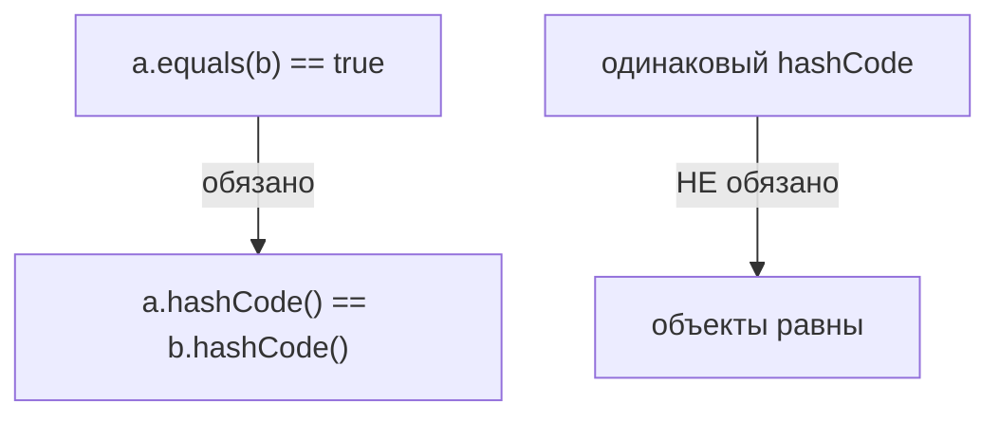
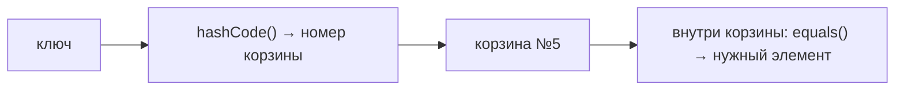

# Почему `equals()` и `hashCode()` переопределяют вместе

Это два метода, которые есть у **каждого** объекта в Java (они объявлены в
классе `Object`). Они отвечают за один вопрос: «одинаковые ли это объекты?».
Проблема в том, что коллекции на хэшах (`HashMap`, `HashSet`) используют **оба**
метода сразу, и если переопределить только один — они начинают работать
неправильно. Разберём почему.

## Что делает каждый метод

- **`equals(other)`** — отвечает на вопрос «равны ли два объекта **по смыслу**».
  По умолчанию он сравнивает **ссылки** — то есть «это буквально
  один и тот же объект в памяти?». Обычно нам нужно не это, а сравнение по полям:
  два `User` с одинаковым `id` — это «один и тот же пользователь».
- **`hashCode()`** — возвращает `int`, своего рода «числовой отпечаток»
  объекта. По умолчанию оно берётся из адреса объекта в памяти, поэтому у двух
  разных объектов почти всегда разные числа, даже если поля совпадают.

## Договорённость (контракт) между ними

Между этими методами есть жёсткое правило:

> Если два объекта **равны** по `equals()`, то их `hashCode()` **обязан** совпадать.

Обратное — необязательно: два объекта могут иметь **одинаковый** `hashCode`, но
быть **не равны** (это нормально, называется «коллизия»). Главное — равные
объекты не могут иметь разные хэши.



## Почему это ломает `HashMap` и `HashSet`

Чтобы понять проблему, надо знать, **как `HashMap` ищет элемент**. Он делает это
в два шага:

1. Берёт `hashCode()` ключа и по нему вычисляет **корзину** (bucket) — грубо
   говоря, «в какой ящик положить». Это быстро, потому что не нужно перебирать всё.
2. Внутри корзины сравнивает ключи через `equals()`, чтобы найти именно нужный.



Ключевая мысль: **сначала хэш выбирает корзину, потом equals ищет внутри неё.**
Если хэши не совпадают — до сравнения `equals` дело даже не дойдёт, потому что
объекты окажутся в **разных корзинах**.

### Ошибка №1: переопределили только `equals`

Возьмём класс, где `equals` сравнивает по `id`, а `hashCode` забыли:

```java
class User {
    int id;
    User(int id) { this.id = id; }

    @Override
    public boolean equals(Object o) {
        if (!(o instanceof User u)) return false;
        return this.id == u.id;   // равны, если одинаковый id
    }
    // hashCode НЕ переопределён — берётся дефолтный, по адресу
}
```

Что произойдёт:

```java
Map<User, String> map = new HashMap<>();
map.put(new User(1), "Аня");

String name = map.get(new User(1));   // ожидаем "Аня"
System.out.println(name);             // а получаем null!
```

Почему `null`? Два объекта `new User(1)` **равны** по `equals`, но у них **разные**
`hashCode` (дефолтный — по адресу, а это два разных объекта в памяти). Значит,
`get` пойдёт искать в **другую корзину**, чем та, куда положил `put`, и просто не
найдёт. С `HashSet` та же беда — в него можно положить два «одинаковых» объекта,
и он не заметит дубликат.

### Ошибка №2: переопределили только `hashCode`

Тогда хэши совпадут, и объекты попадут в одну корзину. Но внутри корзины `HashMap`
сравнивает через `equals`, а он дефолтный — **по ссылке**. Два разных объекта по
ссылке не равны, поэтому нужный элемент снова не найдётся. Результат тот же —
поиск не работает.

**Вывод:** для корректной работы в хэш-коллекциях нужны **оба** метода, причём
согласованные — построенные **на одних и тех же полях**.

## Как сделать правильно

Берём одни и те же поля и в `equals`, и в `hashCode`. Руками это писать не нужно —
есть удобные помощники `Objects.equals()` и `Objects.hash()`:

```java
class User {
    int id;
    String name;

    @Override
    public boolean equals(Object o) {
        if (this == o) return true;
        if (!(o instanceof User u)) return false;
        return id == u.id && Objects.equals(name, u.name);
    }

    @Override
    public int hashCode() {
        return Objects.hash(id, name);   // те же поля, что в equals
    }
}
```

На практике эти методы обычно **генерирует IDE** или добавляет Lombok через
`@EqualsAndHashCode` — руками их пишут редко, но понимать, что внутри, важно.

!!! warning "Не клади в ключи изменяемые поля"
    Если поле, по которому считается `hashCode`, **поменять уже после** того, как
    объект положили в `HashMap`, объект «потеряется»: хэш пересчитается, и он
    окажется не в той корзине. Поэтому ключами делают неизменяемые объекты
    (например, `String`, `Integer`) или хотя бы не меняют у ключа поля,
    участвующие в `equals`/`hashCode`.

Подробный разбор самого класса `Object` и этих методов — в теме
[`Object`, `equals` и `hashCode`](../../java/core/object-equals-hashcode.md).
