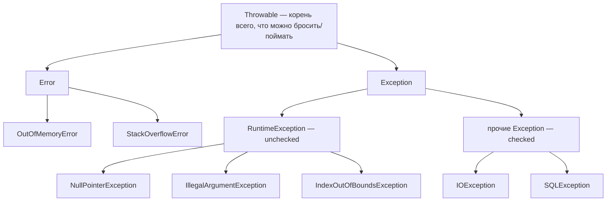
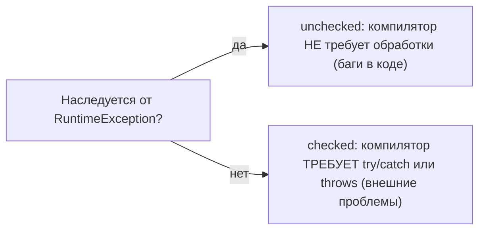

# Иерархия исключений в Java

Все ошибки и исключения в Java — это объекты, выстроенные в одну иерархию наследования
с общим корнем **`Throwable`**. Понимание этой иерархии сразу отвечает на кучу
вопросов: что можно ловить, что бросать, какие исключения обязательны к обработке, а
какие нет.

## Общая картина

Разберём каждый уровень.

## `Throwable` — корень

`Throwable` — базовый класс всего, что можно бросить через `throw` и поймать через
`catch`. У него две большие ветки: **`Error`** и **`Exception`**.

## `Error` — фатальные проблемы, их не ловят

`Error` — это серьёзные проблемы **самой JVM или окружения**, которые приложение
обычно не может (и не должно) обрабатывать:

- **`OutOfMemoryError`** — закончилась память;
- **`StackOverflowError`** — переполнение стека (например, бесконечная рекурсия).

Их не ловят и не пытаются восстановиться — если кончилась память, делать в `catch`
нечего. Это ветка «всё плохо, приложению пора падать».

## `Exception` — то, с чем работает приложение

`Exception` — ошибки уровня приложения, которые как раз ожидается обрабатывать. Эта
ветка делится на два принципиально разных вида: **checked** и **unchecked**.

### `RuntimeException` — unchecked (непроверяемые)

Всё, что наследуется от `RuntimeException`, — **unchecked**. Компилятор **не заставляет**
их обрабатывать или объявлять. Обычно это **ошибки в коде** (баги):

- **`NullPointerException`** — обращение к `null`;
- **`IllegalArgumentException`** — в метод передали недопустимый аргумент;
- **`IndexOutOfBoundsException`** — выход за границы массива/списка.

Идея: такие ошибки не «обрабатывают» в каждом месте, их **предотвращают** правильным
кодом (проверить на null, проверить индекс).

### Checked (проверяемые) исключения

Всё, что наследуется от `Exception`, но **не** от `RuntimeException`, — **checked**.
Компилятор **обязывает** их либо обработать (`try/catch`), либо объявить в сигнатуре
(`throws`). Иначе код не скомпилируется.

- **`IOException`** — ошибка ввода-вывода (файл, сеть);
- **`SQLException`** — ошибка при работе с БД.

Идея: это **ожидаемые внешние проблемы**, не зависящие от твоего кода (файл может не
найтись, сеть — отвалиться), и язык заставляет тебя про них подумать.

## Checked vs unchecked — коротко

| | Checked | Unchecked (`RuntimeException`) |
|---|---|---|
| Компилятор требует обработки | да | нет |
| Типичная причина | внешние проблемы (файл, сеть, БД) | ошибки в коде (null, индекс) |
| Примеры | `IOException`, `SQLException` | `NullPointerException`, `IllegalArgumentException` |

Это напрямую связано с откатом транзакций в Spring: по умолчанию `@Transactional`
откатывается только на **unchecked**-исключениях, а на checked — нет.

## Что запомнить

- Корень — **`Throwable`**, две ветки: **`Error`** и **`Exception`**.
- **`Error`** — фатальные проблемы JVM (`OutOfMemoryError`, `StackOverflowError`), их
  не ловят.
- **`Exception`** → **`RuntimeException` (unchecked)** — баги в коде, компилятор не
  требует обработки; **checked** (всё остальное) — внешние проблемы, компилятор
  требует `try/catch` или `throws`.
- Checked/unchecked определяется по наследованию от `RuntimeException`.
