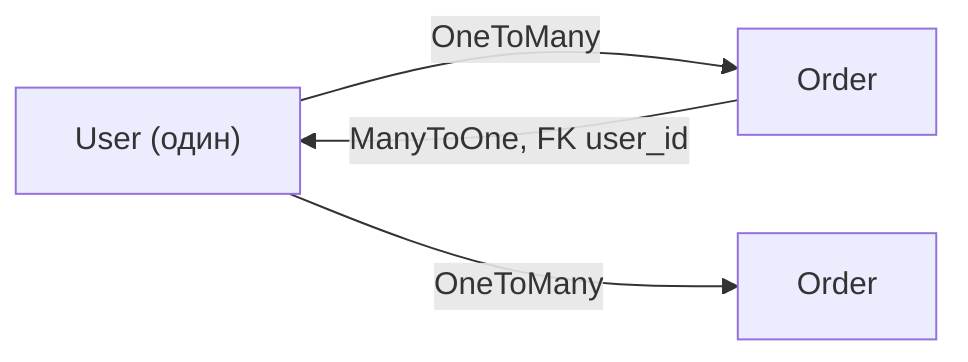

# Связи между сущностями, `Cascade` и `orphanRemoval`

В БД таблицы связаны через внешние ключи. В JPA это выражается **связями между
сущностями**: `@OneToMany`, `@ManyToOne`, `@OneToOne`, `@ManyToMany`. Разберём их и
две важные настройки — `cascade` и `orphanRemoval`.

## Виды связей

- **`@ManyToOne`** — «много к одному». Много заказов принадлежат одному пользователю.
  Именно на этой стороне лежит внешний ключ (колонка `user_id` в таблице заказов).
- **`@OneToMany`** — «один ко многим», обратная сторона: у одного пользователя много
  заказов.
- **`@OneToOne`** — «один к одному» (пользователь ↔ профиль).
- **`@ManyToMany`** — «многие ко многим» (студенты ↔ курсы), через промежуточную
  таблицу.

```java
@Entity
class Order {
    @ManyToOne                       // владелец связи, здесь внешний ключ
    @JoinColumn(name = "user_id")
    private User user;
}

@Entity
class User {
    @OneToMany(mappedBy = "user")    // обратная сторона
    private List<Order> orders = new ArrayList<>();
}
```

`mappedBy` говорит «внешний ключ находится на **той** стороне, в поле `user`» — чтобы
Hibernate не создавал лишнюю таблицу связи.



!!! tip "По умолчанию делай связи LAZY"
    `@ManyToOne` и `@OneToOne` по умолчанию **EAGER** (грузятся сразу), что часто
    приводит к лишним запросам. Обычно их явно делают
    `fetch = FetchType.LAZY`. Подробнее — [LAZY/EAGER](lazy-eager.md).

## `cascade` — каскадные операции

`cascade` говорит: «операцию над родителем **перенести** на связанные сущности». Без
каскада, сохранив `User`, ты не сохранишь его новые `Order` — их надо сохранять
отдельно.

```java
@OneToMany(mappedBy = "user", cascade = CascadeType.ALL)
private List<Order> orders;
```

- `CascadeType.PERSIST` — сохранил родителя → сохранятся и дети.
- `CascadeType.REMOVE` — удалил родителя → удалятся дети.
- `CascadeType.ALL` — все операции разом.

Каскад удобен для отношения «родитель владеет детьми» (заказ и его позиции). Но
`REMOVE`/`ALL` **опасны** на связях, где «дети» разделяются с другими (можно снести
лишнее) — их вешают осознанно.

## `orphanRemoval` — удаление «сирот»

`orphanRemoval = true` означает: если убрать ребёнка **из коллекции родителя**, он
считается «осиротевшим» и **удаляется из БД**.

```java
@OneToMany(mappedBy = "order", cascade = CascadeType.ALL, orphanRemoval = true)
private List<OrderItem> items;

// ...
order.getItems().remove(item);   // item удалится из БД при flush
```

Разница с `CascadeType.REMOVE`: `REMOVE` удаляет детей при удалении **родителя**, а
`orphanRemoval` — ещё и когда ребёнка просто **отвязали** от родителя. Нужен для
composition — когда ребёнок не существует без родителя (позиция заказа).

## Что запомнить

- `@ManyToOne` — сторона с внешним ключом; `@OneToMany` — обратная (`mappedBy`).
- Связи `@ManyToOne`/`@OneToOne` лучше явно делать LAZY.
- `cascade` — переносит операции (persist/remove) с родителя на детей; `ALL`/`REMOVE`
  — с осторожностью.
- `orphanRemoval = true` — удаляет ребёнка, когда его убрали из коллекции родителя.
