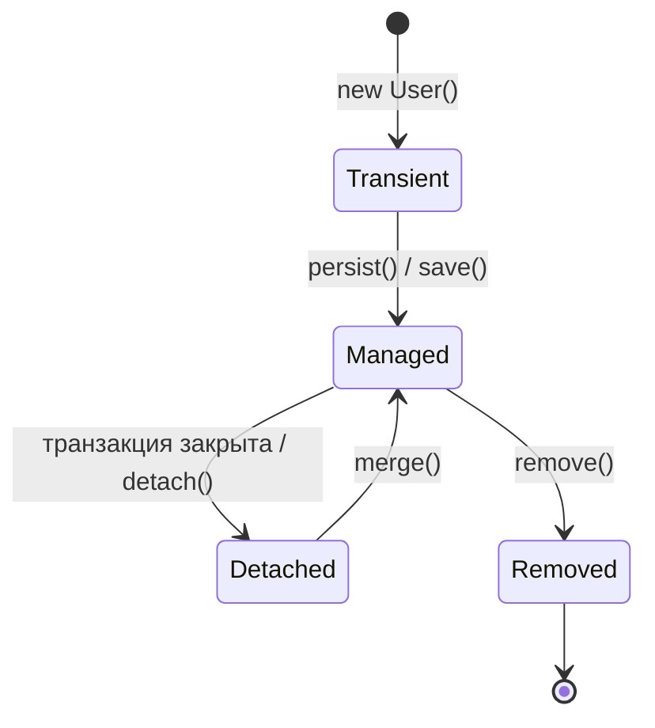

# Жизненный цикл Entity и Persistence Context

Чтобы понимать, как ведёт себя Hibernate (когда он идёт в БД, когда кэширует, почему
объект «сам» сохраняется), нужно знать две вещи: **состояния сущности** и
**Persistence Context**. Это ключ ко многим вопросам про JPA.

## Persistence Context — «рабочий стол» Hibernate

**Persistence Context** (контекст персистентности) — это область в памяти, где
Hibernate держит все сущности, с которыми сейчас работает. Его удобно представлять
как «рабочий стол»: пока объект лежит на столе, Hibernate за ним **следит** и знает
о всех изменениях.

Живёт Persistence Context обычно в рамках **транзакции**: открылась транзакция —
появился контекст, закрылась — контекст очистился. Управляет им `EntityManager`.

## Состояния сущности

Объект-сущность может быть в одном из состояний — они как раз про отношение объекта к
Persistence Context:



- **Transient (новый)** — объект только создан через `new`, Hibernate о нём не знает,
  в БД его нет. Нет `@Id` от базы.
- **Managed (управляемый)** — объект в Persistence Context, Hibernate за ним следит.
  Любое изменение полей будет **автоматически** сохранено в БД при flush (см.
  dirty checking ниже). Это состояние после `save()`/`persist()` или после загрузки
  из БД.
- **Detached (отсоединённый)** — объект был managed, но контекст закрылся (например,
  транзакция завершилась). Данные есть, но Hibernate за ним **больше не следит** —
  изменения полей в БД не попадут. Отсюда растёт `LazyInitializationException`.
- **Removed (удалённый)** — помечен на удаление (`remove()`), будет удалён из БД при
  flush.

## Главное следствие: автосохранение (dirty checking)

Раз за managed-объектом Hibernate следит, менять его в БД **не нужно вызовом
save**. Достаточно поменять поле:

```java
@Transactional
public void rename(Long id, String newName) {
    User user = repo.findById(id).orElseThrow();  // managed
    user.setName(newName);                          // просто меняем поле
    // никакого save() не нужно! Hibernate сам заметит изменение
    // и на commit сделает UPDATE
}
```

Это называется **dirty checking**: при завершении транзакции Hibernate сравнивает
managed-объекты с их исходным состоянием и сам генерирует `UPDATE` для изменённых.

## Что запомнить

- **Persistence Context** — «рабочий стол» Hibernate в рамках транзакции; следит за
  сущностями.
- Состояния: **transient** (новый, вне БД) → **managed** (под присмотром) →
  **detached** (контекст закрыт, присмотра нет) / **removed** (на удаление).
- За managed-объектом следит Hibernate: поменял поле → на commit будет `UPDATE`
  автоматически (**dirty checking**), явный `save()` не обязателен.
