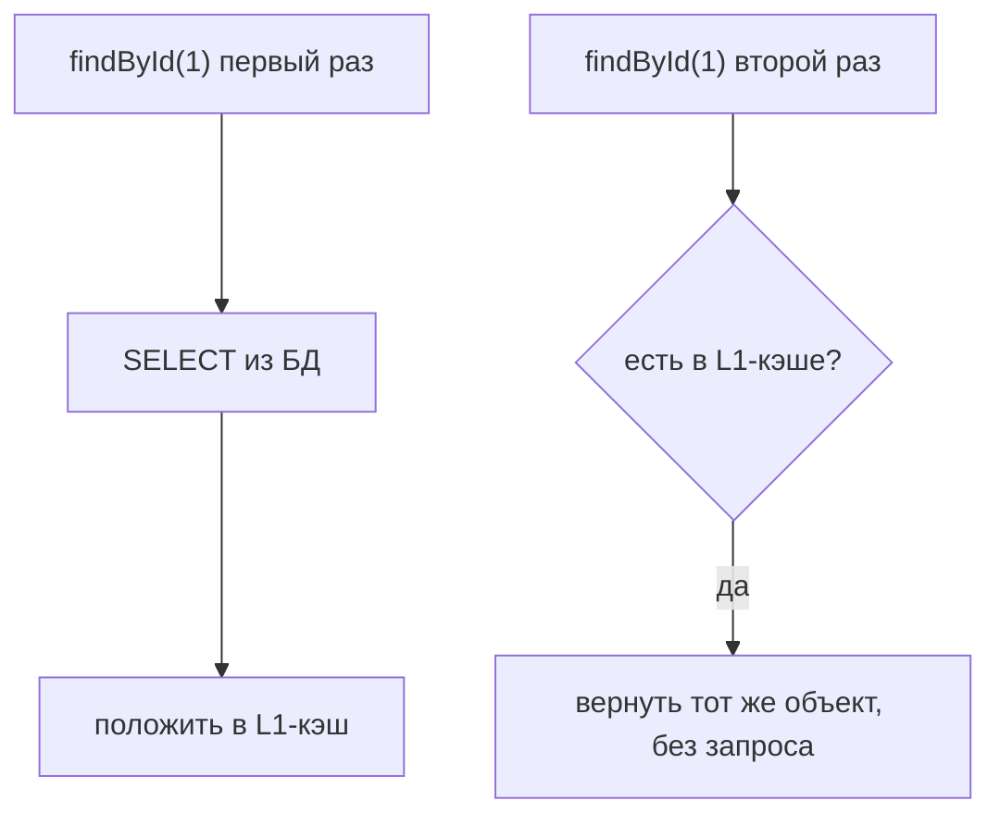

# Первый уровень кэша Hibernate

**Первый уровень кэша** (L1 cache) — это, по сути, и есть
[Persistence Context](entity-lifecycle.md). Он работает **всегда**, отключить его
нельзя. Понимание, как он кэширует, объясняет, почему Hibernate иногда не идёт в БД,
а иногда идёт лишний раз.

## Что это такое

Первый уровень кэша — это память **в пределах одной транзакции** (одного
`EntityManager`), где Hibernate хранит уже загруженные сущности. Правило простое:
**в рамках одной транзакции каждую сущность по её id Hibernate загрузит из БД только
один раз**.

```java
@Transactional
public void demo() {
    User u1 = repo.findById(1L).orElseThrow();  // SELECT в БД
    User u2 = repo.findById(1L).orElseThrow();  // из кэша, БЕЗ запроса в БД!

    System.out.println(u1 == u2);   // true — это один и тот же объект
}
```

Второй `findById(1L)` не идёт в базу — Hibernate видит, что сущность с этим id уже
на «рабочем столе», и отдаёт **тот же самый объект**.



## Зачем это нужно

- **Меньше запросов** — повторное обращение к той же сущности не бьёт по БД.
- **Идентичность объектов** — одна сущность в рамках транзакции представлена **одним**
  объектом; не будет двух разных `User` с id=1, которые рассинхронизируются.
- Основа для [dirty checking](entity-lifecycle.md) — Hibernate помнит исходное
  состояние объектов, чтобы найти изменения.

## Важные ограничения

- Кэш живёт **только в пределах транзакции/сессии**. Новая транзакция — новый пустой
  кэш. Это **не** общий кэш между запросами (тот — «второй уровень», отдельный и
  подключается вручную).
- Кэш работает по `findById` (по первичному ключу). **JPQL-запрос** (`@Query`,
  `findByName`) всё равно идёт в БД, но его результаты тоже кладутся в L1.
- В долгой транзакции с тысячами сущностей кэш **растёт** и ест память — иногда его
  чистят вручную (`entityManager.clear()`).

## Что запомнить

- Первый уровень кэша = Persistence Context, работает всегда, в пределах одной
  транзакции.
- Одна сущность по id грузится из БД **один раз**; повторный `findById` — из кэша, тот
  же объект.
- Это не общий кэш между запросами (это второй уровень) и он растёт в памяти при
  больших транзакциях.
