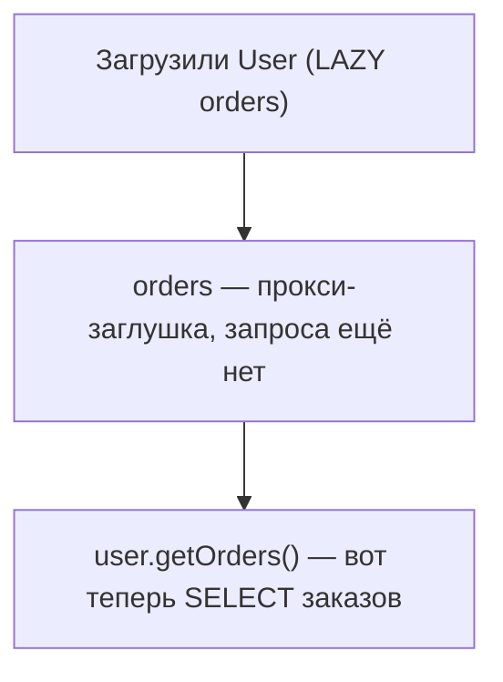
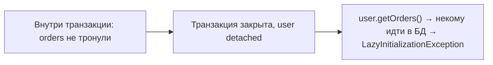

# Ленивая и жадная загрузка; `LazyInitializationException`

Когда мы грузим сущность со связями (пользователь и его заказы), встаёт вопрос:
тянуть связанные данные **сразу** вместе с ней или **потом**, когда понадобятся?
Это и есть EAGER vs LAZY. С LAZY связана знаменитая ошибка
`LazyInitializationException` — разберём и её.

## EAGER и LAZY

- **EAGER (жадная)** — связанные сущности грузятся **сразу**, вместе с основной, одним
  или несколькими запросами.
- **LAZY (ленивая)** — связанные сущности грузятся **только когда к ним обратишься**.
  До этого вместо коллекции стоит специальная заглушка (прокси).

```java
@OneToMany(mappedBy = "user", fetch = FetchType.LAZY)
private List<Order> orders;
```



**Значения по умолчанию:**

- `@OneToMany`, `@ManyToMany` — **LAZY** (коллекции ленивы).
- `@ManyToOne`, `@OneToOne` — **EAGER** (грузятся сразу).

На практике почти всегда стремятся к **LAZY везде** (в том числе явно ставят LAZY на
`@ManyToOne`), чтобы не тащить из БД лишнее. Нужные данные подгружают
целенаправленно через `JOIN FETCH` (см. [N+1](n-plus-1.md)).

## `LazyInitializationException`

Это самая частая ошибка при LAZY. Возникает, когда пытаешься обратиться к ленивой
связи **уже после закрытия транзакции** — когда сущность стала
[detached](entity-lifecycle.md).

```java
@Transactional
public User getUser(Long id) {
    return repo.findById(id).orElseThrow();   // orders не загружены (LAZY)
}   // транзакция закрылась, Persistence Context закрыт → user стал detached

// потом, вне транзакции:
user.getOrders().size();   // LazyInitializationException!
```

Почему: чтобы подгрузить ленивые заказы, нужен живой Persistence Context (открытая
транзакция). А она уже закрыта — Hibernate не может сходить в БД. Отсюда исключение.



## Как чинить (правильно и неправильно)

**Правильно** — загрузить нужные данные **пока транзакция открыта**:

- `JOIN FETCH` в запросе: `SELECT u FROM User u JOIN FETCH u.orders WHERE ...` —
  тянет заказы сразу вместе с пользователем.
- `@EntityGraph` на методе репозитория — то же, но декларативно.
- Обратиться к `user.getOrders()` внутри транзакционного метода — тогда подгрузится.

**Неправильно / костыли** (лучше не надо):

- сделать связь EAGER — потянет лишнее всегда, породит N+1;
- `spring.jpa.open-in-view=true` (Open Session In View) — держит сессию открытой до
  конца запроса, маскирует проблему и вредит производительности.

## Что запомнить

- EAGER — грузить связь сразу; LAZY — при обращении. По умолчанию коллекции LAZY,
  `@ManyToOne`/`@OneToOne` — EAGER (их лучше делать LAZY).
- `LazyInitializationException` — обращение к ленивой связи **после** закрытия
  транзакции (сущность detached).
- Лечить загрузкой нужного внутри транзакции: **`JOIN FETCH`** или **`@EntityGraph`**,
  а не переводом всего в EAGER.
