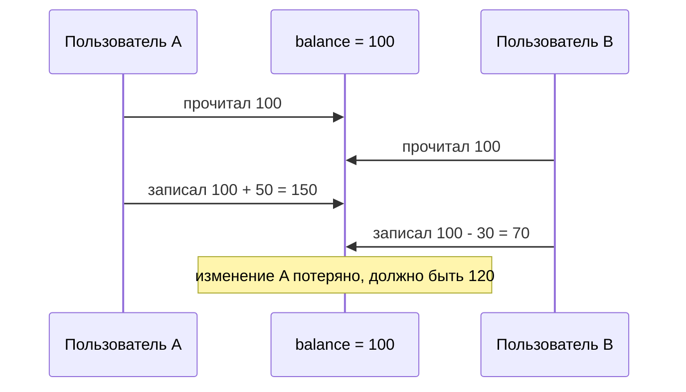

# Оптимистичная и пессимистичная блокировка

Обе решают одну проблему: **два пользователя одновременно меняют одну и ту же
запись**, и один может затереть изменения другого (потерянное обновление). Разница —
в подходе: пессимистичная **блокирует заранее**, оптимистичная **проверяет в конце**.

## Проблема: потерянное обновление



## Оптимистичная блокировка — «проверить в конце»

**Идея:** ничего заранее не блокируем, а при сохранении проверяем — «никто не менял
запись, пока я с ней работал?». Если менял — бросаем ошибку и просим повторить.

Реализуется через **поле-версию** `@Version`:

```java
@Entity
class Account {
    @Id Long id;
    Long balance;

    @Version          // Hibernate сам его увеличивает при каждом UPDATE
    Long version;
}
```

Как работает: Hibernate добавляет версию в условие `UPDATE`:

```sql
UPDATE account SET balance = 150, version = 6
WHERE id = 1 AND version = 5;    -- version = 5, каким прочитали
```

Если кто-то уже обновил запись, версия в БД стала 6, условие `version = 5` не
совпадёт → обновится **0 строк** → Hibernate бросит
`OptimisticLockException`. Приложение ловит её и повторяет операцию.

- **Плюс:** не держит блокировок, отлично масштабируется, БД не простаивает.
- **Минус:** при конфликте — переделывать работу (повтор).
- **Когда:** конфликты **редки** (обычный веб). Это выбор по умолчанию.

## Пессимистичная блокировка — «заблокировать заранее»

**Идея:** как только я беру запись на изменение, я её **блокирую** в БД, и другие
ждут, пока я закончу. Никто не влезет.

```java
@Lock(LockModeType.PESSIMISTIC_WRITE)
@Query("SELECT a FROM Account a WHERE a.id = :id")
Account findForUpdate(@Param("id") Long id);
```

Под капотом это `SELECT ... FOR UPDATE` — БД ставит блокировку на строку до конца
транзакции.

- **Плюс:** конфликт исключён, повторов не будет.
- **Минус:** другие **ждут**, хуже параллелизм; риск [deadlock](../concurrency/deadlock.md).
- **Когда:** конфликты **часты**, и переделывать дорого (списание денег, склад с
  дефицитным товаром).

## Сравнение

| | Оптимистичная | Пессимистичная |
|---|---|---|
| Подход | проверить версию в конце | заблокировать строку сразу |
| Блокировки в БД | нет | да (`FOR UPDATE`) |
| При конфликте | ошибка + повтор | другие ждут |
| Когда | конфликты редки (по умолчанию) | конфликты часты |
| Реализация | `@Version` | `@Lock(PESSIMISTIC_WRITE)` |

## Что запомнить

- Обе — против потерянного обновления при конкурентном доступе.
- **Оптимистичная** (`@Version`): не блокирует, проверяет версию при `UPDATE`, при
  конфликте — `OptimisticLockException` и повтор. По умолчанию.
- **Пессимистичная** (`SELECT FOR UPDATE`): блокирует строку заранее, остальные ждут.
  Для частых конфликтов и критичных операций.
