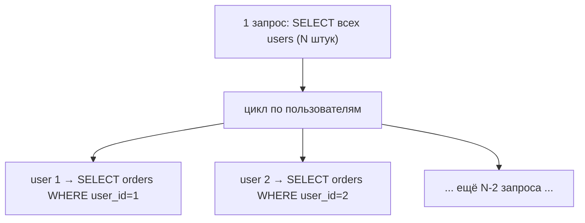

# Проблема N+1 запросов

Одна из самых частых проблем производительности в JPA/Hibernate и **очень** частый
вопрос на собеседовании. Суть: вместо одного запроса Hibernate незаметно делает
**десятки или сотни** запросов к БД. Разберём максимально подробно — как возникает,
как заметить и все способы лечения.

## Откуда берётся: разбор по шагам

Возьмём две сущности: пользователь и его заказы.

```java
@Entity
class User {
    @Id Long id;
    String name;

    @OneToMany(mappedBy = "user")   // LAZY по умолчанию
    List<Order> orders;
}
```

Теперь загрузим всех пользователей и выведем количество заказов у каждого:

```java
List<User> users = userRepository.findAll();   // запрос 1: SELECT * FROM users

for (User user : users) {
    // для КАЖДОГО пользователя — отдельный запрос за его заказами
    System.out.println(user.getOrders().size());
}
```

Что реально уходит в БД, если пользователей 100:

```sql
SELECT * FROM users;                          -- 1 запрос (получили 100 юзеров)
SELECT * FROM orders WHERE user_id = 1;       -- +1
SELECT * FROM orders WHERE user_id = 2;       -- +1
SELECT * FROM orders WHERE user_id = 3;       -- +1
...                                           -- ... и так 100 раз
```

Итого: **1** запрос за пользователями + **N** запросов за заказами (по одному на
каждого) = **N + 1** запрос. Отсюда и название.



**Почему так происходит:** связь `orders` — ленивая (LAZY). При `findAll()` заказы не
грузятся. Но как только в цикле мы обращаемся к `user.getOrders()`, Hibernate
понимает, что для **этого** пользователя надо сходить в БД — и делает отдельный
`SELECT`. В цикле это повторяется N раз.

Для 100 пользователей — 101 запрос вместо 1–2. На больших данных это кладёт
производительность: приложение «тормозит на ровном месте».

## Как заметить N+1

- **Включить показ SQL** и посмотреть в логи — если на одну операцию сыплются
  десятки однотипных `SELECT`, это оно:

```properties
spring.jpa.show-sql=true
spring.jpa.properties.hibernate.format_sql=true
```

- Инструменты вроде **p6spy** или datasource-proxy считают запросы.
- В тестах можно посчитать число запросов и упасть, если их слишком много.

## Способы решения

### 1. `JOIN FETCH` — забрать всё одним запросом

Пишем запрос, который сразу подтягивает заказы через `JOIN`:

```java
@Query("SELECT DISTINCT u FROM User u JOIN FETCH u.orders")
List<User> findAllWithOrders();
```

Теперь Hibernate делает **один** запрос с джойном вместо N+1:

```sql
SELECT u.*, o.* FROM users u JOIN orders o ON o.user_id = u.id;
```

`DISTINCT` нужен, чтобы из-за джойна пользователи не дублировались в результате.

### 2. `@EntityGraph` — то же, но декларативно

`@EntityGraph` говорит «загрузи вот эти связи сразу», без ручного JPQL:

```java
@EntityGraph(attributePaths = "orders")
List<User> findAll();
```

Удобно, когда хочется оставить обычный метод репозитория, но подгрузить связи.
Подробнее — в вопросе про [EntityGraph vs JOIN FETCH](#entitygraph-vs-join-fetch).

### 3. Batch fetching — грузить связи пачками

Настройка `@BatchSize` / `hibernate.default_batch_fetch_size` говорит Hibernate:
подгружай ленивые связи не по одной, а **пачками через `IN`**:

```sql
SELECT * FROM orders WHERE user_id IN (1, 2, 3, ..., 100);
```

Тогда вместо N запросов будет N/размер_пачки. Не убирает проблему полностью, но резко
сокращает число запросов. Хорош, когда джойн тянул бы слишком много данных.

### 4. Отдельным запросом (для коллекций)

Иногда осознанно грузят родителей одним запросом, а детей — вторым запросом с `IN`
(две операции вместо N+1). Так делает, например, `@BatchSize` и подход с двумя
выборками.

## `@EntityGraph` vs `JOIN FETCH`

Делают одно и то же — грузят связь сразу. Разница в удобстве:

| | `JOIN FETCH` | `@EntityGraph` |
|---|---|---|
| Где пишется | в тексте JPQL-запроса | аннотацией над методом |
| Гибкость | полный контроль над запросом | проще, декларативно |
| Когда удобнее | сложный запрос с условиями | добавить загрузку к обычному методу |

Оба варианта правильные. `JOIN FETCH` — когда и так пишешь `@Query`. `@EntityGraph` —
когда хочешь оставить производный метод (`findByActiveTrue`) и просто дотянуть связи.

## Чего НЕ надо делать

- **Не** переводить связь в `EAGER`, чтобы «убрать N+1». EAGER не убирает проблему —
  он делает те же лишние запросы **всегда**, даже когда заказы не нужны. Лечить надо
  **точечной** загрузкой там, где данные реально нужны.

## Что запомнить

- N+1: 1 запрос за родителями + по 1 запросу на связь каждого = N+1 запрос. Причина —
  обращение к LAZY-связи в цикле.
- Заметить — по логам SQL (куча однотипных `SELECT`).
- Лечить: **`JOIN FETCH`** или **`@EntityGraph`** (забрать одним запросом), либо
  **batch fetching** (пачками через `IN`).
- EAGER — **не** решение: он просто делает лишние запросы всегда.
