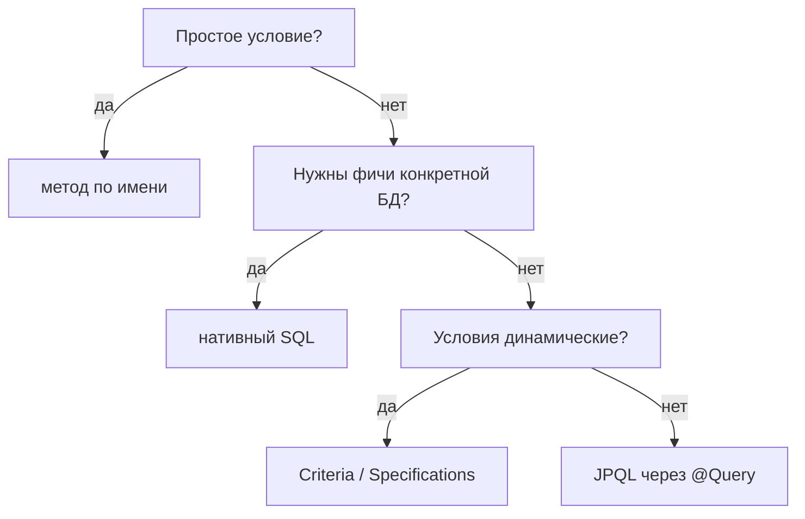

# Сложные запросы в JPA: `@Query`, JPQL, нативный SQL, Criteria

В Spring Data есть несколько способов написать запрос — от «метода по имени» до
ручного SQL. Вопрос в том, **когда что** выбирать. Пройдёмся от простого к гибкому.

## 1. Методы по имени (derived queries)

Самый простой способ — назвать метод так, чтобы Spring сам построил запрос:

```java
List<User> findByNameAndActiveTrue(String name);
List<User> findByAgeGreaterThanOrderByNameAsc(int age);
```

Spring разбирает имя (`findBy...`) и генерирует запрос. Годится для **несложных**
условий. Когда условий много, имя метода становится нечитаемым — пора переходить к
`@Query`.

## 2. JPQL через `@Query`

**JPQL** — язык запросов JPA. Похож на SQL, но оперирует **сущностями и полями**, а
не таблицами и колонками:

```java
@Query("SELECT u FROM User u WHERE u.age > :age AND u.active = true")
List<User> findAdults(@Param("age") int age);
```

Обрати внимание: `User` и `u.age` — это **класс и его поле**, а не `users` и колонка.
Hibernate сам переведёт JPQL в SQL под конкретную БД. Это основной способ для
осмысленных запросов — переносим между БД, работает с сущностями.

## 3. Нативный SQL

Когда нужны возможности конкретной БД, которых нет в JPQL (оконные функции, CTE,
специфичный синтаксис), пишут **нативный SQL**:

```java
@Query(value = "SELECT * FROM users WHERE age > :age", nativeQuery = true)
List<User> findAdultsNative(@Param("age") int age);
```

Здесь уже настоящие имена **таблиц и колонок**. Минус — привязка к конкретной СУБД и
потеря части удобств JPA.

## 4. Criteria API

**Criteria API** — способ строить запрос **из кода**, объектами, а не строкой. Нужен,
когда запрос **динамический** — набор условий зависит от того, какие фильтры передал
пользователь:

```java
CriteriaBuilder cb = em.getCriteriaBuilder();
CriteriaQuery<User> cq = cb.createQuery(User.class);
Root<User> root = cq.from(User.class);

List<Predicate> filters = new ArrayList<>();
if (name != null) filters.add(cb.equal(root.get("name"), name));
if (minAge != null) filters.add(cb.greaterThan(root.get("age"), minAge));

cq.where(filters.toArray(new Predicate[0]));   // собрали условия динамически
```

Плюс — гибко и типобезопасно. Минус — многословно и хуже читается. На практике
динамические запросы часто делают через **Specifications** (обёртку Spring Data над
Criteria) или библиотеку QueryDSL.

## Как выбрать



## Что запомнить

- **Метод по имени** — для простых условий.
- **JPQL (`@Query`)** — основной способ; оперирует сущностями, переносим между БД.
- **Нативный SQL** — когда нужны возможности конкретной СУБД; привязка к ней.
- **Criteria / Specifications** — для **динамических** запросов, собираемых из кода.
