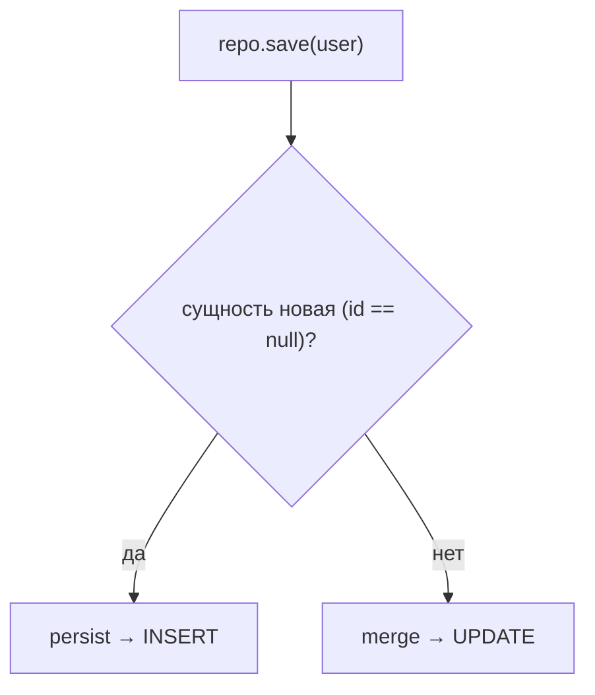

# `save` / `persist` / `merge` — в чём разница

Три метода про «сохранить сущность», которые легко перепутать. Ключ к пониманию —
[состояния сущности](entity-lifecycle.md): каждый метод рассчитан на свой случай.
Разберём.

## `persist` — вставить новую сущность

`persist` (метод JPA / `EntityManager`) переводит **новую** (transient) сущность в
managed — то есть говорит Hibernate «начни следить за этим объектом, это новая
запись». На commit будет `INSERT`.

```java
User user = new User("Аня");   // transient
em.persist(user);               // теперь managed, будет INSERT
```

- Работает с **новыми** объектами.
- **Ничего не возвращает** — делает managed **тот же** переданный объект (и
  проставляет ему сгенерированный id).
- Если передать сущность, которая уже есть в БД (detached) — ошибка.

## `merge` — вернуть в управление отсоединённую сущность

`merge` нужен для **detached**-объекта (был managed, но контекст закрылся, см.
[жизненный цикл](entity-lifecycle.md)). Он **копирует** состояние переданного объекта
в managed-копию и возвращает **её**.

```java
// user пришёл откуда-то, он detached (например, из прошлой транзакции)
User managed = em.merge(user);   // ВАЖНО: работать дальше с managed, не с user!
```

Ключевой момент: `merge` **возвращает новый managed-объект**, а переданный так и
остаётся detached. Дальше надо использовать возвращённое значение.

Как ведёт себя `merge`:

- нет id или записи в БД → сделает `INSERT` (как новую);
- id есть и запись существует → загрузит её и **обновит** (`UPDATE`).

## `save` (Spring Data) — «умный» универсальный

`save` из `JpaRepository` — обёртка Spring Data, которая **сама выбирает** между
`persist` и `merge`:

```java
User saved = repo.save(user);   // Spring сам решит: INSERT или UPDATE
```

Логика внутри простая — «новая ли это сущность?»:

- если сущность **новая** (обычно id == null) → вызывает `persist`;
- если **не новая** (id задан) → вызывает `merge`.

Поэтому в Spring Data обычно пользуются просто `save` и не думают про `persist`/
`merge` напрямую. Но помнить про особенность `merge` (возврат нового объекта) важно —
`save` тоже **возвращает** сохранённый объект, и работать надо с ним.



## Частая ошибка

Использовать переданный объект после `merge`/`save`, а не возвращённый:

```java
repo.save(user);          // а надо: user = repo.save(user);
user.setName("новое");    // при merge это изменение может не отследиться
```

Всегда работай с тем, что **вернул** `save`/`merge`.

## Что запомнить

- `persist` — для **новых** сущностей, `INSERT`; делает managed переданный объект.
- `merge` — для **detached**; копирует в managed-копию и **возвращает её** (исходный
  остаётся detached).
- `save` (Spring Data) — сам выбирает `persist` или `merge` по тому, новая ли
  сущность; используй **возвращённый** объект.
