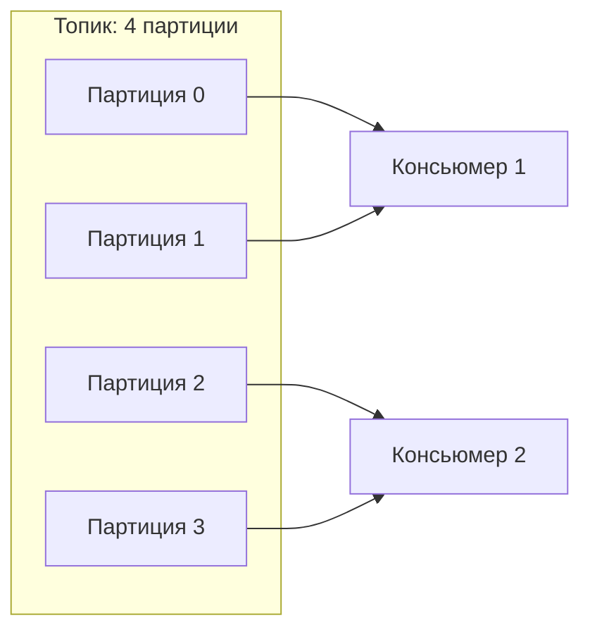
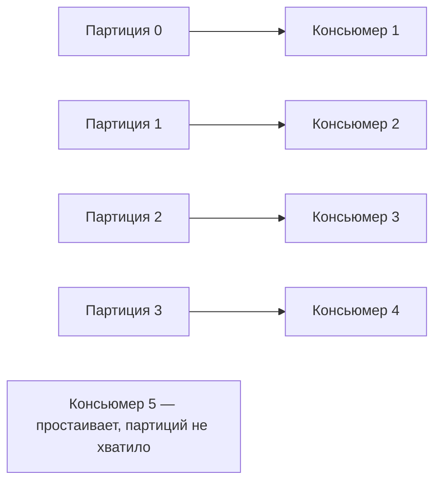
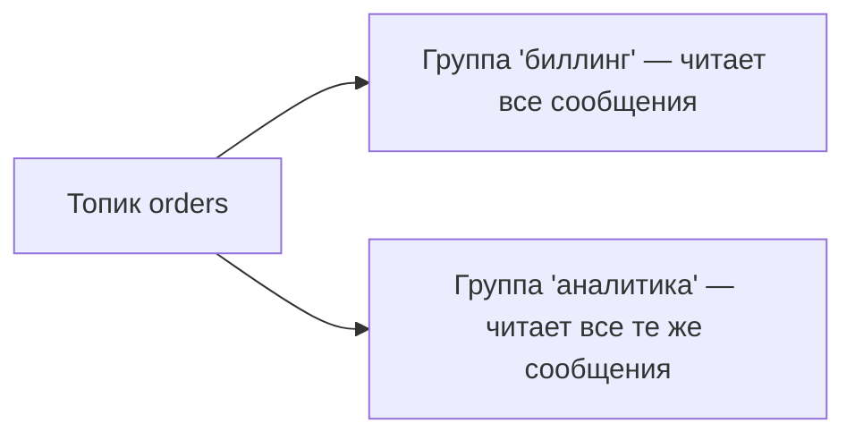

# Consumer group и распределение партиций

**Consumer group** (группа консьюмеров) — это способ разделить работу по чтению
топика между несколькими консьюмерами и одновременно основа масштабирования Kafka.
Ключевое правило, которое любят спрашивать: **одну партицию читает только один
консьюмер группы**, поэтому консьюмеров в группе не может быть больше, чем партиций.

## Как делятся партиции

Консьюмеры с одним `group.id` — это одна группа. Kafka распределяет партиции топика
между её участниками так, чтобы каждую партицию читал **ровно один** консьюмер
группы. Так работа делится, а сообщение внутри группы обрабатывается один раз.

Добавили ещё консьюмеров — партиции перераспределятся (rebalance), нагрузка ляжет
ровнее. Это и есть горизонтальное масштабирование чтения.

## Почему консьюмеров не больше, чем партиций

Раз партицию читает **только один** консьюмер группы, то при 4 партициях максимум 4
консьюмера получат работу. Пятый и далее будут **простаивать** — им просто не
достанется партиции.

**Практический вывод:** число партиций задаёт **потолок параллелизма** для группы.
Хочешь больше параллельных консьюмеров — нужно больше партиций (о выборе их числа —
[отдельный вопрос](partition-count.md)).

## Несколько групп читают независимо

Важное отличие Kafka от очереди: **разные группы** получают **все** сообщения
независимо друг от друга. Каждая группа держит свои offset'ы.

То есть внутри группы сообщение делится (каждое обработает кто-то один), а между
группами — дублируется (каждая группа видит всё). Поэтому одно событие могут
независимо обрабатывать биллинг, аналитика и уведомления — каждая своя группа.

## Что запомнить

- Consumer group делит партиции топика между участниками: одну партицию читает
  **ровно один** консьюмер группы.
- Поэтому консьюмеров в группе **не больше, чем партиций**; лишние простаивают.
- Число партиций = потолок параллелизма группы.
- **Разные группы** читают весь топик **независимо**, каждая со своими offset'ами.
