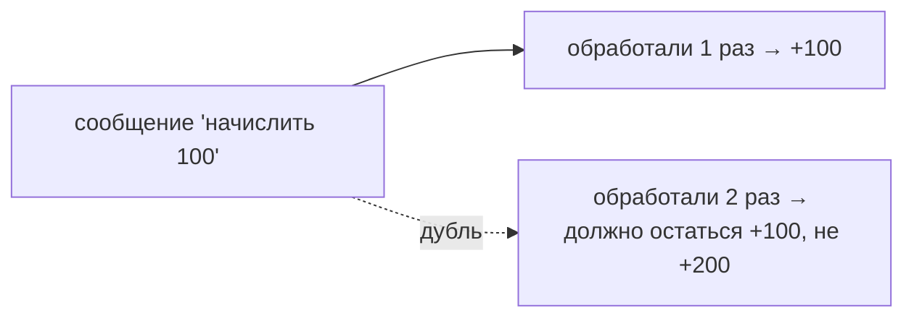

# Как не обработать сообщение дважды

Kafka по умолчанию даёт [at-least-once](delivery-semantics.md) — значит, сообщение
**может прийти консьюмеру повторно**. Полностью убрать дубли трудно и дорого, поэтому
на практике идут другим путём: делают **обработку идемпотентной**, чтобы повтор был
безопасен. Разберём, почему дубли неизбежны и как с ними жить.

## Почему дубли неизбежны

Повтор возникает штатно, не только при «поломках»:

- консьюмер обработал сообщение, но упал **до коммита** offset → после перезапуска
  перечитает его ([сценарии падения](offset-crash-scenarios.md));
- **rebalance** передал партицию другому консьюмеру, а последний обработанный offset
  ещё не был закоммичен;
- обработка затянулась, консьюмера выкинули из группы, пачка ушла заново.

Вывод: рассчитывать «сообщение придёт ровно один раз» **нельзя**. Обработчик обязан
корректно пережить повтор.

## Что такое идемпотентная обработка

**Идемпотентность** — свойство, при котором повторная обработка **не меняет
результат** по сравнению с однократной. Обработал сообщение один раз или три —
состояние системы одинаковое. Тогда дубль просто не вредит.



## Способы сделать обработку идемпотентной

### 1. Дедупликация по идентификатору сообщения

У сообщения есть уникальный бизнес-ключ или id. Храним обработанные id и **пропускаем**
повтор:

```java
if (processedIds.contains(msg.getId())) {
    return;                    // уже обрабатывали — пропускаем
}
process(msg);
processedIds.add(msg.getId());
```

Хранят обработанные id обычно в БД (таблица с уникальным ключом) или в Redis.

### 2. Идемпотентная операция в БД

Сформулировать саму операцию так, чтобы повтор был безопасен:

- **upsert** («вставить или обновить») вместо «вставить» — повтор не создаст дубль;
- `UPDATE ... SET status = 'PAID'` (установить значение) вместо «прибавить дельту» —
  повтор ничего не меняет;
- **уникальное ограничение** в БД (например, на `order_id`) — вторая вставка упадёт, и
  её можно спокойно проигнорировать.

### 3. Проверка состояния перед действием

Перед выполнением проверить, не сделано ли уже: «заказ уже оплачен? тогда ничего не
делаем».

## Связь с общей идемпотентностью

Это частный случай большой темы — [идемпотентность в распределённых
системах](../patterns/idempotency-distributed.md). Идея одна: раз повторы неизбежны,
операции проектируют так, чтобы повтор не вредил, вместо того чтобы пытаться повторы
полностью исключить.

## Что запомнить

- Kafka — at-least-once, дубли **штатны** (падение до коммита, rebalance) — исключить
  их полностью трудно.
- Решение — **идемпотентная обработка**: повтор не меняет результат.
- Способы: **дедупликация по id** сообщения, **идемпотентные операции в БД** (upsert,
  «установить», уникальный индекс), проверка состояния перед действием.
