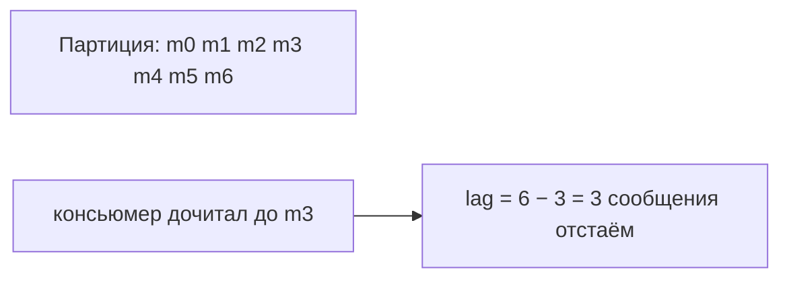
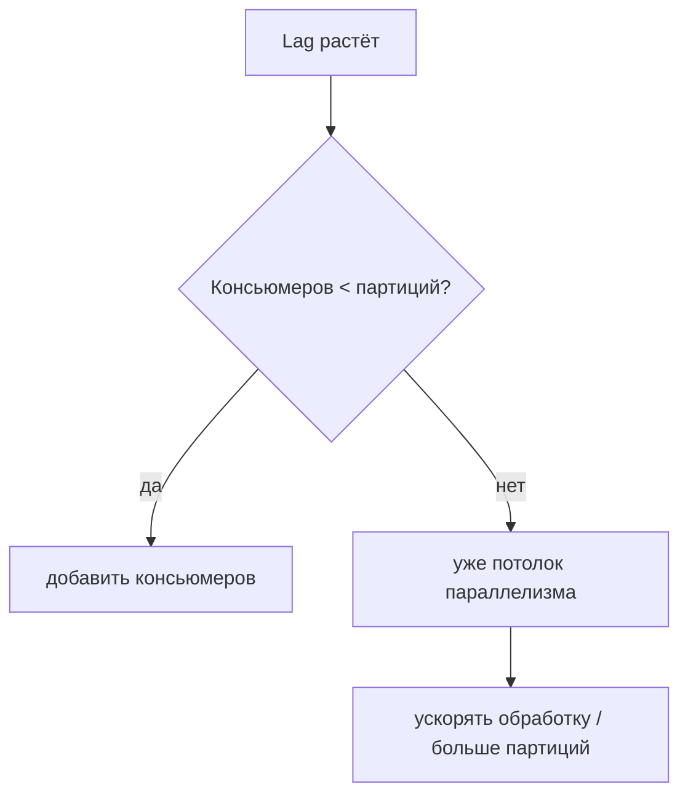

# Consumer lag

**Consumer lag** (отставание консьюмера) — это насколько консьюмер **отстал** от
продюсера: сколько сообщений уже записано, но ещё не прочитано. Это главная метрика
здоровья потребления в Kafka — по ней сразу видно, справляется ли система с потоком.

## Что это по определению

У каждой партиции есть два числа:

- **log end offset** — offset последнего записанного сообщения (докуда дописал
  продюсер);
- **committed offset** — докуда дочитал и закоммитил консьюмер.

**Lag = log end offset − committed offset** — разрыв между ними, «сколько сообщений
ещё не обработано».

- Lag близок к нулю → консьюмер успевает, всё хорошо.
- Lag растёт → консьюмер **не справляется**, свежие данные обрабатываются с задержкой.

## Почему lag растёт

Причина всегда одна: **скорость чтения меньше скорости записи**. А вот почему:

- продюсер разогнался (пик нагрузки), а консьюмеров столько же;
- обработка каждого сообщения медленная (тяжёлый запрос в БД, вызов внешнего сервиса);
- консьюмер подвис / часто уходит в rebalance;
- «горячая партиция» — весь поток в одну партицию, один консьюмер не тянет.

## Как бороться

- **Добавить консьюмеров в группу** — до числа партиций (больше не поможет, см.
  [почему](consumer-group-partitions.md)). Это первый и главный рычаг.
- **Ускорить обработку** — оптимизировать код, батчить запись в БД, убрать лишние
  синхронные вызовы.
- **Увеличить число партиций** — поднять потолок параллелизма (но это
  [не бесплатно и не уменьшается обратно](partition-count.md)).
- **Обрабатывать асинхронно/пачками**, если позволяет логика.

## Предел масштабирования

Ключевой момент «на подумать»: **нельзя бесконечно наращивать консьюмеров**. Потолок —
число партиций: когда консьюмеров столько же, сколько партиций, добавлять новых
бессмысленно (будут простаивать). Дальше остаётся либо ускорять саму обработку, либо
добавлять партиции. Поэтому lag — это часто сигнал, что упёрлись в число партиций.

## Что запомнить

- Lag = сколько сообщений записано, но ещё не прочитано (log end offset − committed
  offset). Ключевая метрика здоровья, по ней алертят.
- Растёт, когда чтение медленнее записи (пик нагрузки, медленная обработка, rebalance,
  горячая партиция).
- Лечить: добавить консьюмеров (**до числа партиций**), ускорить обработку, увеличить
  партиции.
- Предел параллелизма — **число партиций**; уперлись в него → ускорять обработку или
  добавлять партиции.
