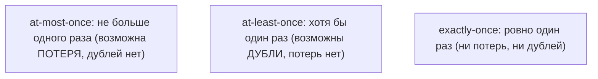
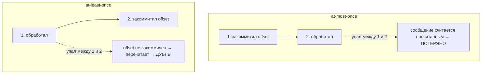

# Три семантики доставки в Kafka

Когда сообщение идёт от продюсера через брокер к консьюмеру, возможны сбои: потеря,
дубль. **Семантика доставки** — это гарантия о том, сколько раз сообщение будет
доставлено/обработано: **at-most-once**, **at-least-once**, **exactly-once**. Разберём
каждую и как она достигается настройками.

## Три варианта

- **at-most-once** — «максимум один раз». Сообщение либо доставлено один раз, либо
  **потеряно**. Дублей нет. Годится там, где потеря не критична (метрики, телеметрия).
- **at-least-once** — «хотя бы один раз». Сообщение точно не потеряется, но может
  прийти **дважды**. Это гарантия **доставки**: дубли возможны. Самый частый вариант
  (что делать с дублями — ниже, в разделе про exactly-once).
- **exactly-once** — «ровно один раз». Ни потерь, ни дублей. Идеал, но самый дорогой и
  сложный.

## От чего зависит семантика

Семантика — это не одна галочка, а **комбинация** настроек продюсера и поведения
консьюмера.

### Сторона продюсера: `acks`

`acks` — сколько подтверждений ждёт продюсер, что запись сохранена:

- **`acks=0`** — не ждёт вообще (fire-and-forget). Быстро, но при сбое сообщение
  **теряется** → тянет к at-most-once.
- **`acks=1`** — ждёт подтверждения от **лидера** партиции. Если лидер упал сразу
  после ответа, не успев реплицировать, — возможна потеря.
- **`acks=all`** — ждёт, пока запись подтвердят все синхронные реплики (ISR). Надёжно,
  не теряется; вместе с `min.insync.replicas` — защита от потери. Медленнее.

### Сторона консьюмера: когда коммитить offset

Тут решается at-most-once vs at-least-once — **в какой момент** консьюмер фиксирует
offset («я это прочитал»):

- **Коммит до обработки** → если упал после коммита, но до обработки, сообщение
  «потеряно» = **at-most-once**.
- **Коммит после обработки** → если упал после обработки, но до коммита, сообщение
  перечитается = **at-least-once** (дубль).

На практике почти всегда выбирают **at-least-once** (коммит после обработки): потерь
нет, а с дублями борются на уровне обработки — как именно, в следующем разделе.

## Как достигается exactly-once

Сначала важное различие: **доставка** и **эффект обработки** — это разные вещи.
Идемпотентная обработка **не убирает** саму повторную доставку (сообщение всё равно
может прийти дважды) — она убирает повторный **эффект**: результат получается один.
«Ровно один раз по результату» — это и есть exactly-once (на уровне эффекта, его ещё
называют «effectively-once»).

Отсюда два пути к exactly-once:

**1. At-least-once доставка + идемпотентный консьюмер — самый частый способ на
практике.** Сообщение может прийти повторно, но обработка идемпотентна (дедуп по id,
`upsert`, уникальный ключ), поэтому повтор даёт **тот же** результат — эффект ровно
один раз. Именно здесь работает идемпотентность **консьюмера**: она превращает
at-least-once доставку в exactly-once по результату.

**2. Родной exactly-once Kafka (EOS)** — для сценария «читаю из Kafka → обрабатываю →
пишу обратно в Kafka»:

- **идемпотентный продюсер** (`enable.idempotence=true`) — убирает дубли **на записи**
  от ретраев продюсера (по sequence number);
- **транзакции** — атомарно «записать результат + закоммитить offset», либо всё, либо
  ничего.

То есть оба пути про идемпотентность, просто на разных уровнях: путь 1 —
идемпотентность **обработки на консьюмере**, путь 2 — идемпотентный **продюсер** +
транзакции. А `acks` к этому не относится — он лишь про то, чтобы сообщение **не
потерялось** при записи (надёжность продюсер→брокер), а не про дубли.

## Что запомнить

- **at-most-once** — возможна потеря, дублей нет; **at-least-once** — возможны дубли,
  потерь нет (самый частый); **exactly-once** — ни того ни другого, но дорого.
- Доставка и эффект — разное: идемпотентность не убирает повторную доставку, а убирает
  повторный **эффект** (результат один).
- **acks** (`acks=all` + `min.insync.replicas`) — про «не потерять» при записи; к
  дублям у консьюмера отношения не имеет.
- Консьюмер: коммит offset **до** обработки → at-most-once, **после** → at-least-once.
- Exactly-once **по результату** на практике = at-least-once доставка + **идемпотентный
  консьюмер**. Родная EOS Kafka = **идемпотентный продюсер** + транзакции.
