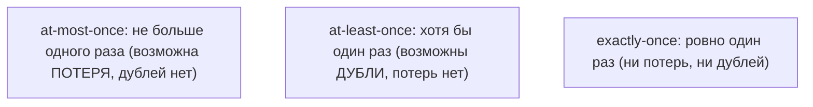
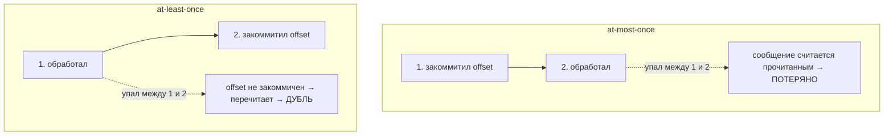

# Три семантики доставки в Kafka

Когда сообщение идёт от продюсера через брокер к консьюмеру, возможны сбои: потеря,
дубль. **Семантика доставки** — это гарантия о том, сколько раз сообщение будет
доставлено/обработано: **at-most-once**, **at-least-once**, **exactly-once**. Разберём
каждую и как она достигается настройками.

## Три варианта

- **at-most-once** — «максимум один раз». Сообщение либо доставлено один раз, либо
  **потеряно**. Дублей нет. Годится там, где потеря не критична (метрики, телеметрия).
- **at-least-once** — «хотя бы один раз». Сообщение точно не потеряется, но может
  прийти **дважды**. Самый частый и практичный вариант; требует **идемпотентности**
  на стороне обработчика.
- **exactly-once** — «ровно один раз». Ни потерь, ни дублей. Идеал, но самый дорогой и
  сложный.

## От чего зависит семантика

Семантика — это не одна галочка, а **комбинация** настроек продюсера и поведения
консьюмера.

### Сторона продюсера: `acks`

`acks` — сколько подтверждений ждёт продюсер, что запись сохранена:

- **`acks=0`** — не ждёт вообще (fire-and-forget). Быстро, но при сбое сообщение
  **теряется** → тянет к at-most-once.
- **`acks=1`** — ждёт подтверждения от **лидера** партиции. Если лидер упал сразу
  после ответа, не успев реплицировать, — возможна потеря.
- **`acks=all`** — ждёт, пока запись подтвердят все синхронные реплики (ISR). Надёжно,
  не теряется; вместе с `min.insync.replicas` — защита от потери. Медленнее.

### Сторона консьюмера: когда коммитить offset

Тут решается at-most-once vs at-least-once — **в какой момент** консьюмер фиксирует
offset («я это прочитал»):

- **Коммит до обработки** → если упал после коммита, но до обработки, сообщение
  «потеряно» = **at-most-once**.
- **Коммит после обработки** → если упал после обработки, но до коммита, сообщение
  перечитается = **at-least-once** (дубль).

На практике почти всегда выбирают **at-least-once** (коммит после обработки) + делают
обработку **идемпотентной**, чтобы дубль был безопасен.

## Как достигается exactly-once

Честный exactly-once в Kafka собирается из двух частей:

- **Идемпотентный продюсер** (`enable.idempotence=true`) — Kafka по sequence number
  отбрасывает дубли, возникшие при ретраях. Убирает дубли на записи.
- **Транзакции** — продюсер атомарно записывает результат **и** коммитит offset
  прочитанного сообщения в одной транзакции (паттерн read-process-write). Либо всё,
  либо ничего.

Это работает в основном для сценария «читаю из Kafka → обрабатываю → пишу обратно в
Kafka». Когда обработка ходит во внешнюю БД, exactly-once обычно проще получить
через at-least-once + идемпотентность на своей стороне, чем через транзакции Kafka.

!!! warning "Две разные «идемпотентности» — не путай"
    Слово «идемпотентность» тут в **двух разных** смыслах, и это частая путаница:

    - **Идемпотентный продюсер** (`enable.idempotence=true`) — фича Kafka. Убирает
      дубли **на записи**, возникшие из-за **ретраев продюсера** (по sequence number).
      Это часть механизма **exactly-once**.
    - **Идемпотентная обработка на консьюмере** — практика приложения, нужна для
      **at-least-once**: раз сообщение может прийти консьюмеру **повторно** (перечитал
      после падения до коммита offset), обработку делают такой, чтобы дубль не навредил.

    Это про **разные источники дублей**. А `acks` вообще не про дубли — он про то,
    чтобы сообщение **не потерялось** при записи (надёжность продюсер→брокер).

## Что запомнить

- **at-most-once** — возможна потеря, дублей нет; **at-least-once** — возможны дубли,
  потерь нет (самый частый); **exactly-once** — ни того ни другого, но дорого.
- Продюсер: `acks=all` (+ `min.insync.replicas`) защищает от потери; `acks=0/1` —
  быстрее, но риск потери.
- Консьюмер: коммит offset **до** обработки → at-most-once, **после** → at-least-once.
- Обычный выбор — **at-least-once + идемпотентность** обработчика. Exactly-once —
  идемпотентный продюсер + транзакции.
