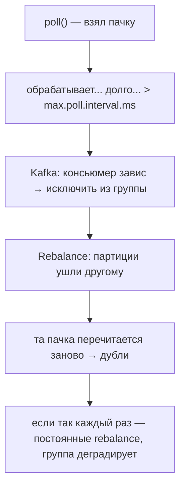

# Долгая обработка и `max.poll.interval.ms`

Тонкий, но частый на практике вопрос: что будет, если консьюмер обрабатывает пачку
сообщений **слишком долго**? Ответ: Kafka решит, что консьюмер «завис», исключит его
из группы и запустит rebalance. Разберём механику и как этого избежать.

## Как Kafka понимает, что консьюмер жив

Консьюмер в цикле вызывает `poll()` — забирает пачку сообщений и обрабатывает. Kafka
следит за «живостью» консьюмера двумя независимыми механизмами:

- **Heartbeat** (сердцебиение) — фоновый поток консьюмера регулярно шлёт сигнал
  координатору. Если сигналов нет дольше `session.timeout.ms` — консьюмер считается
  мёртвым. Это про **сеть/процесс**.
- **`max.poll.interval.ms`** — максимальное время **между двумя вызовами `poll()`**
  (по умолчанию 5 минут). Это про **обработку**: если ты застрял на обработке пачки и
  не позвал `poll()` вовремя — Kafka решает, что консьюмер завис.

## Что происходит при превышении

Если обработка одной пачки заняла дольше `max.poll.interval.ms`, консьюмер не успевает
позвать `poll()`, координатор считает его выбывшим и запускает **rebalance** —
партиции отдают другому консьюмеру.

Хуже всего, что это может **зациклиться**: медленный консьюмер выбрасывается, пачка
уходит другому, тот тоже не успевает — и группа буксует в бесконечных rebalance,
почти ничего не обрабатывая.

## Как избежать

- **Обрабатывать меньше за один `poll()`** — уменьшить `max.poll.records`, чтобы пачка
  была маленькой и обрабатывалась быстро.
- **Увеличить `max.poll.interval.ms`**, если обработка действительно долгая по своей
  природе (даёт больше времени между poll).
- **Ускорить обработку** — оптимизировать код, батчить запись в БД.
- **Вынести тяжёлую работу в отдельный поток/пул**, а в цикле poll быстро отдавать
  сообщения на обработку (но тогда сложнее с коммитом offset — надо коммитить только
  реально обработанное).

## Что запомнить

- Консьюмер обязан регулярно звать `poll()`; за живостью следят **heartbeat**
  (`session.timeout.ms`, про процесс) и **`max.poll.interval.ms`** (про обработку).
- Обработка пачки дольше `max.poll.interval.ms` → консьюмера выкидывают из группы →
  **rebalance** и перечитывание пачки (дубли), риск бесконечных rebalance.
- Лечится: меньше `max.poll.records`, больше `max.poll.interval.ms`, ускорение
  обработки или вынос тяжёлой работы в отдельный поток.
