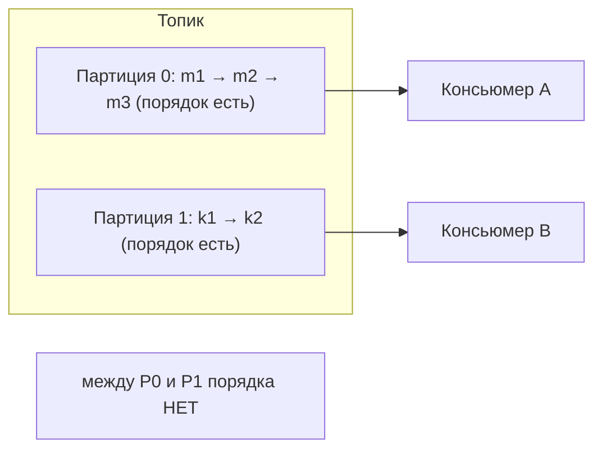
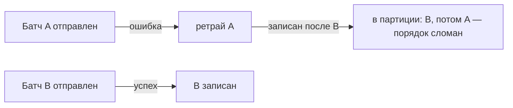

# Порядок сообщений в Kafka

Kafka гарантирует порядок сообщений **только внутри одной партиции**, а не по всему
топику. Это ключевой момент, и вокруг него много подвохов — например, порядок может
сломаться даже внутри партиции из-за ретраев продюсера. Разберём.

## Почему порядок только внутри партиции

Топик разбит на партиции, и они читаются **параллельно** разными консьюмерами. У
каждой партиции свой независимый поток с нумерацией сообщений (offset). Между
партициями нет общего «времени» — сообщение из партиции 0 и из партиции 1 могут быть
обработаны в любом порядке.



Гарантировать глобальный порядок можно было бы только одной партицией — но тогда
теряется параллелизм и масштаб. Поэтому Kafka сознательно даёт порядок лишь в
пределах партиции.

## Как сохранить порядок для связанных событий

Если важен порядок событий по одной сущности (все операции по счёту `accountId`),
их нужно направить в **одну** партицию. Для этого используют **ключ** сообщения:
Kafka по хэшу ключа выбирает партицию, поэтому все сообщения с одним ключом попадают
в одну партицию и читаются по порядку.

```java
// все события по accountId=42 попадут в одну партицию → порядок сохранён
producer.send(new ProducerRecord<>("operations", "42", event));
```

Нет ключа — сообщения распределяются равномерно между партициями, и порядок между
ними не гарантирован.

## Подвох: порядок ломается даже внутри партиции

Вот это часто и есть «вопрос на подумать». Порядок внутри партиции может нарушиться
из-за **ретраев продюсера**.

Продюсер шлёт сообщения не по одному, а несколькими «в полёте» одновременно
(`max.in.flight.requests.per.connection`, по умолчанию 5). Представим:

1. отправлены батч A, затем батч B;
2. батч A **упал** (сетевая ошибка), батч B **записался**;
3. продюсер **повторяет** батч A — и он записывается **после** B.

Итог: B оказался в партиции раньше A, хотя отправляли A первым — порядок нарушен.



**Как чинить:**

- **`enable.idempotence=true`** (идемпотентный продюсер) — Kafka нумерует сообщения
  (sequence number) и сама сохраняет порядок даже при ретраях и нескольких запросах
  «в полёте». Это рекомендуемый способ, в новых версиях включён по умолчанию.
- Исторический способ — `max.in.flight.requests.per.connection=1` (только один запрос
  за раз), но он снижает пропускную способность.

## Что запомнить

- Порядок гарантируется **только внутри партиции**, между партициями — нет.
- Нужен порядок по сущности → шли события с одним **ключом** → одна партиция.
- Порядок может сломаться даже внутри партиции из-за **ретраев продюсера** при
  нескольких запросах «в полёте».
- Лечится **идемпотентным продюсером** (`enable.idempotence=true`).
