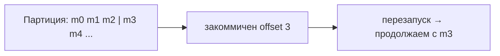
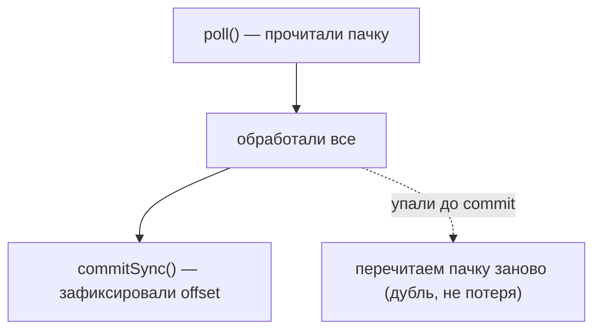

# Коммит offset: auto-commit vs ручной

**Offset** — позиция консьюмера в партиции, «до какого сообщения я дочитал».
**Коммит offset** — сохранение этой позиции, чтобы после перезапуска продолжить с
нужного места, а не с начала. От того, **как** коммитить (автоматически или вручную),
напрямую зависит, потеряются ли сообщения или задублируются.

## Зачем вообще коммитить offset

Консьюмер читает партицию и должен где-то запомнить, докуда дошёл. Эта позиция
хранится в самой Kafka (в служебном топике `__consumer_offsets`). Если консьюмер
перезапустится или партиция перейдёт к другому консьюмеру, чтение продолжится с
**последнего закоммиченного** offset.



## Auto-commit (автоматический)

При `enable.auto.commit=true` (по умолчанию) консьюмер **сам** периодически коммитит
offset в фоне — раз в `auto.commit.interval.ms` (по умолчанию 5 секунд).

- **Плюс:** ничего не надо делать вручную, просто.
- **Минус:** коммит идёт **по таймеру**, а не по факту обработки. Из-за этого:
  - offset может закоммититься для сообщений, которые ты **ещё не успел обработать**
    → при сбое они будут считаться прочитанными и **потеряются**;
  - либо, наоборот, обработал, но до автокоммита упал → **дубли**.

То есть auto-commit не даёт контроля над тем, что «обработано». Годится, когда потеря
части сообщений не страшна.

## Ручной коммит

При `enable.auto.commit=false` ты коммитишь **сам, явно, после обработки**:

```java
records.forEach(record -> process(record));   // сначала обработали
consumer.commitSync();                          // потом закоммитили
```

- **`commitSync()`** — коммитит синхронно, **ждёт** подтверждения и **повторяет** при
  ошибке. Надёжно, но чуть медленнее.
- **`commitAsync()`** — коммитит асинхронно, не ждёт, без ретраев. Быстрее, но при
  сбое коммита возможны дубли.

Ручной коммит **после** обработки даёт [at-least-once](delivery-semantics.md): если
упасть между обработкой и коммитом — сообщение перечитается (дубль, но не потеря).
Это то, что нужно в большинстве систем, где терять сообщения нельзя.



## Что выбрать

- **Auto-commit** — только если потеря части сообщений допустима и хочется простоты.
- **Ручной коммит после обработки** — стандарт для надёжной обработки (at-least-once).
  Обработку при этом делают [идемпотентной](consumer-idempotency.md), чтобы дубли были
  безопасны.

## Что запомнить

- Offset — позиция чтения; коммит нужен, чтобы после перезапуска продолжить с места.
- **Auto-commit** — по таймеру, просто, но нет привязки к «обработано» → риск потерь и
  дублей.
- **Ручной коммит после обработки** (`commitSync`/`commitAsync`) — контроль и
  at-least-once; предпочтительный вариант.
- Дубли лечим идемпотентностью, а не отказом от ручного коммита.
