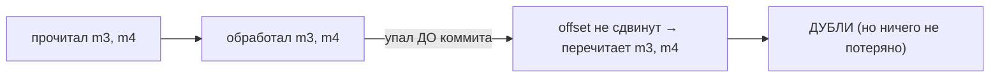
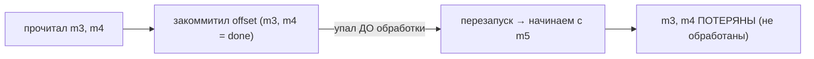

# Что будет с сообщениями, если консьюмер упал

Классический сценарный вопрос «на подумать». Ответ целиком зависит от того, **в какой
момент** консьюмер закоммитил offset относительно обработки. Разберём оба случая — это
и есть суть at-least-once vs at-most-once на практике.

## Напоминание: offset решает всё

После падения консьюмера его партиции достаются другому консьюмеру группы (через
rebalance), и тот начинает читать с **последнего закоммиченного offset**. Значит,
судьба необработанных сообщений зависит от того, был ли уже закоммичен их offset.
Подробнее про коммит — [здесь](offset-commit.md).

## Случай 1: упал, НЕ закоммитив offset

Консьюмер прочитал сообщения, обработал (или не успел), но **offset закоммитить не
успел** — упал.

Что произойдёт: offset остался на старом значении → другой консьюмер (или этот после
перезапуска) **перечитает** эти сообщения заново.

- **Итог: дубли, но нет потерь.** Это **at-least-once**.
- Если обработка уже что-то сделала (записала в БД), повторная обработка сделает это
  **второй раз** — отсюда требование [идемпотентности](consumer-idempotency.md).

## Случай 2: закоммитил offset, но упал ДО обработки

Обратная ситуация — offset закоммичен **раньше**, чем сообщение реально обработано
(так бывает при auto-commit или если коммитить в начале).

Что произойдёт: offset уже сдвинут → эти сообщения считаются «прочитанными» → после
перезапуска их **никто не перечитает**.

- **Итог: потеря сообщений, но без дублей.** Это **at-most-once**.

## Вывод: коммит после обработки

Отсюда практическое правило: **коммить offset после успешной обработки**, а не до.
Тогда худшее, что случится при падении, — повторная обработка (дубль), а не потеря.
А дубли обезвреживаются идемпотентностью.

| Когда упал | offset | Результат | Семантика |
|---|---|---|---|
| до коммита (коммит после обработки) | не сдвинут | перечитает → дубль | at-least-once |
| после коммита (коммит до обработки) | сдвинут | пропустит → потеря | at-most-once |

## Что запомнить

- После падения консьюмер продолжает с **последнего закоммиченного offset**.
- Упал **не закоммитив** → сообщения **перечитаются** (дубли, потерь нет) —
  at-least-once.
- Закоммитил **до обработки** и упал → сообщения **пропадут** (потеря, дублей нет) —
  at-most-once.
- Правильно — **коммитить после обработки** + делать обработку идемпотентной.
