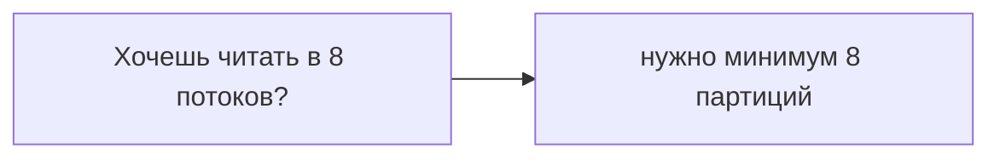
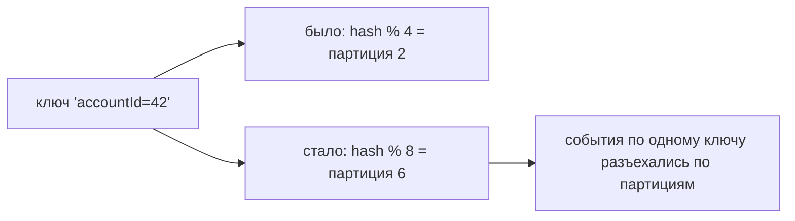

# Как выбрать число партиций

Число партиций топика — важное проектное решение, которое любят обсуждать на собесе,
потому что оно влияет и на масштаб, и на порядок, и его **сложно поменять потом**.
Разберём, что даёт больше партиций и чем за это платят.

## Партиции = параллелизм

Главное, что дают партиции, — **параллелизм чтения**. Одну партицию читает только один
консьюмер группы (см. [consumer group](consumer-group-partitions.md)), поэтому число
партиций задаёт **потолок** одновременных консьюмеров в группе.

Практическое правило: партиций должно быть **не меньше**, чем максимальное желаемое
число параллельных консьюмеров. Ещё прикидывают по целевой пропускной способности:
«сколько МБ/с тянет одна партиция» × число партиций ≥ нужный поток.

## Чем платят за много партиций

Партиции не бесплатны — просто «поставить 1000 на всякий случай» плохо:

- **Больше накладных расходов на брокерах** — каждая партиция это открытые файлы,
  память, метаданные. Тысячи партиций нагружают кластер.
- **Дольше выбор лидеров и rebalance** — при сбое брокера нужно переназначить лидеров
  всех его партиций; чем их больше, тем дольше пауза.
- **Может вырасти end-to-end задержка** — больше партиций для репликации и координации.
- **Больше файлов и памяти у консьюмеров/продюсеров.**

Так что число партиций — это **баланс** между параллелизмом и накладными расходами, а
не «чем больше, тем лучше».

## Главный подвох: партиции нельзя уменьшить

- **Увеличить** число партиций можно, **уменьшить — нельзя** (только пересоздавать
  топик). Поэтому лучше не завышать сгоряка.
- Увеличение партиций **ломает привязку «ключ → партиция»**: Kafka выбирает партицию
  по `hash(ключ) % число_партиций`. Изменилось число партиций — тот же ключ может
  попасть в **другую** партицию. Для уже записанных данных это значит, что порядок по
  ключу больше не гарантируется через границу изменения.

Поэтому число партиций стараются **продумать заранее**, часто закладывая запас.

## Что запомнить

- Партиции дают **параллелизм**; их число — потолок консьюмеров в группе и основа
  пропускной способности.
- Плата за избыток: накладные расходы на брокерах, дольше rebalance/выбор лидера,
  возможный рост задержки.
- Партиции можно **увеличить, но не уменьшить**; увеличение **ломает** привязку
  ключа к партиции (порядок по ключу).
- Вывод: выбирать по целевому параллелизму/потоку с запасом, но без фанатизма.
