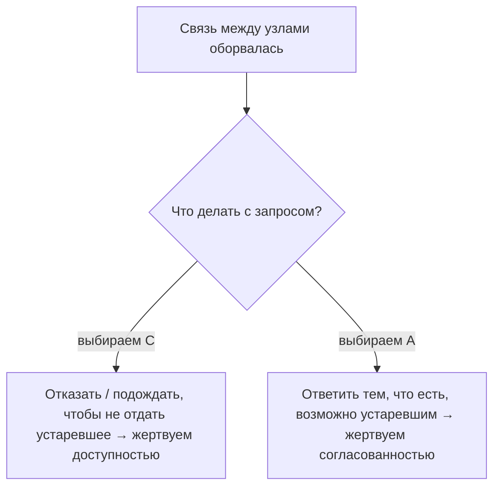

# CAP-теорема на пальцах

**CAP-теорема** — про фундаментальный компромисс в распределённых системах (когда
данные хранятся на нескольких узлах). Она говорит: из трёх свойств **нельзя иметь все
три сразу** — приходится жертвовать одним. Разберём, что это за свойства и в чём суть.

## Три буквы

- **C — Consistency (согласованность)** — все узлы отдают **одинаковые, самые свежие**
  данные. Записал на один узел — тут же читаешь актуальное с любого.
- **A — Availability (доступность)** — система **отвечает** на каждый запрос (пусть и
  не самыми свежими данными), не зависает и не отказывает.
- **P — Partition tolerance (устойчивость к разделению сети)** — система продолжает
  работать, даже если связь **между узлами прервалась** (network partition).

## Суть: при сбое сети выбираешь C или A

Ключевой момент, который часто недопонимают: в распределённой системе сеть **рано
или поздно рвётся**, поэтому **P — обязательна**, от неё не отказаться. А значит,
реальный выбор — **между C и A** в момент, когда узлы потеряли связь друг с другом.

Представь: два узла перестали видеть друг друга, и приходит запрос на запись/чтение.

- **Выбрали C (CP-система):** чтобы не отдать устаревшие данные, узел **откажет** в
  ответе, пока связь не восстановится. Данные всегда верные, но доступность страдает.
- **Выбрали A (AP-система):** узел **ответит** тем, что у него есть, даже если это
  чуть устаревшие данные. Система всегда отвечает, но данные временно
  несогласованны.

## Примеры

- **CP** (важна согласованность): банковский баланс, где нельзя показать неверную
  сумму. Лучше отказать, чем соврать.
- **AP** (важна доступность): лента новостей, счётчик лайков — лучше показать чуть
  устаревшее, чем ничего. Позже данные «догонят» (см.
  [eventual consistency](eventual-consistency.md)).

## Важные оговорки

- CAP работает **только когда сеть разорвана**. Пока всё в порядке, система может
  давать и C, и A одновременно.
- Это не «раз и навсегда для всей системы» — разные части системы могут выбирать
  по-разному.

## Что запомнить

- CAP: **Consistency** (свежие одинаковые данные), **Availability** (всегда отвечает),
  **Partition tolerance** (переживает разрыв сети) — все три сразу нельзя.
- В распределённой системе **P обязательна**, поэтому выбор реально идёт **между C и
  A** в момент разрыва сети.
- **CP** — отказать, но не соврать (банк); **AP** — ответить, пусть и устаревшим
  (лента, лайки).
