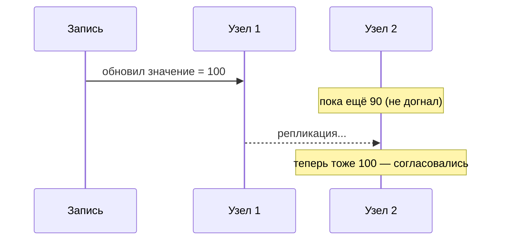

# Что такое eventual consistency

**Eventual consistency (итоговая/конечная согласованность)** — модель, при которой
данные на разных узлах становятся одинаковыми **не мгновенно, а спустя некоторое
время**. Какой-то короткий период разные узлы могут отдавать разные данные, но в
итоге все «догонят» и придут к одному состоянию.

## Сильная vs итоговая согласованность

- **Строгая (strong) согласованность** — после записи **любой** следующий читатель
  сразу видит новое значение. Удобно, но в распределённой системе дорого: нужно
  синхронно обновить все копии, а это медленно и снижает доступность.
- **Итоговая (eventual) согласованность** — запись применяется **не сразу везде**;
  копии обновляются постепенно. На короткое время читатель может увидеть **старое**
  значение, но «в конце концов» все узлы придут к актуальному.

## Простой пример

Загрузил новое фото профиля. Ты сразу видишь новое (тебя обслужил обновлённый узел),
а друг ещё пару секунд видит старое (его обслужил узел, куда изменение не доехало).
Через момент у всех новое. Это и есть eventual consistency — и для аватарки это
абсолютно нормально.

## Зачем на это идут

Итоговая согласованность — плата за **доступность и масштабируемость** в
распределённых системах (прямая связь с [CAP](cap.md), выбор в пользу A). Она
позволяет системе быстро отвечать и переживать сбои, не дожидаясь синхронного
обновления всех копий.

Возникает она естественно везде, где есть асинхронность:

- реплики БД (читаешь с реплики, куда изменение ещё не доехало);
- обмен через брокер (событие обработается чуть позже);
- кэши (значение в кэше временно устарело).

## Чем за это платим

- **Временно устаревшие данные** — надо закладывать в логику, что читатель может
  увидеть не самое свежее.
- Нужна **[идемпотентность](idempotency-distributed.md)** — сообщения могут прийти
  повторно.
- Сложнее рассуждать о системе.

Поэтому итоговую согласованность выбирают там, где **короткая рассинхронизация
допустима** (лента, счётчики, аватарки), а где нельзя (деньги, остаток товара) —
берут более строгие гарантии.

## Что запомнить

- Eventual consistency — копии данных согласуются **со временем**, не мгновенно; на
  короткий срок возможны устаревшие чтения.
- Это плата за доступность и масштабируемость (сторона **A** в CAP).
- Возникает при репликах, брокерах, кэшах.
- Подходит там, где короткая рассинхронизация не критична; требует идемпотентности.
