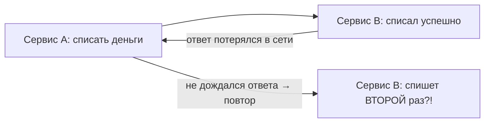

# Идемпотентность в распределённых системах

**Идемпотентность** — свойство операции, при котором **повторное выполнение не меняет
результат** по сравнению с однократным. В распределённых системах это не роскошь, а
необходимость: сообщения и запросы там **регулярно повторяются**, и без защиты это
приводит к дубликатам (два списания, два заказа).

## Почему повторы неизбежны

В сети ответ может **не дойти**, хотя операция на самом деле выполнилась:



A не знает, выполнилась операция или нет, и **повторяет** её. То же самое с Kafka:
гарантия доставки обычно **at-least-once** — «хотя бы один раз», то есть сообщение
**может прийти дважды**. Значит, обработчик обязан быть готов к повтору.

## Как сделать операцию идемпотентной

Идея одна: **распознать повтор и не выполнять действие второй раз**. Способы:

### 1. Ключ идемпотентности

Клиент присылает уникальный идентификатор операции (`Idempotency-Key`). Сервер
**запоминает** обработанные ключи. Пришёл запрос с уже виденным ключом — не выполняем
снова, а возвращаем прежний результат.

```java
if (processedKeys.contains(key)) {
    return previousResult;   // повтор — не делаем второй раз
}
process();
processedKeys.add(key);
```

### 2. Дедупликация по ID сообщения

Для событий из брокера: у каждого сообщения есть уникальный ID. Обработчик хранит ID
уже обработанных и **пропускает** повторные.

### 3. Естественная идемпотентность операции

Иногда операцию можно сформулировать так, что повтор безопасен сам по себе:

- «**установить** статус = PAID» — идемпотентно (повтор ничего не меняет);
- «**добавить** 100 к балансу» — **не** идемпотентно (каждый повтор прибавляет).

Где можно — предпочитают формулировку в стиле «установить», а не «изменить на
дельту».

### 4. Уникальные ограничения в БД

Уникальный индекс (например, на `order_id`) не даст вставить дубликат — вторая
попытка упадёт, и её можно спокойно проигнорировать.

## Где это всплывает

- **Kafka-консьюмеры** — at-least-once, сообщение может прийти повторно.
- **Платежи** — повтор запроса не должен списать дважды.
- **Ретраи** любых сетевых вызовов.
- Связка с [Outbox](../../engineering/design/outbox.md) и
  [Saga](../../engineering/design/consistency-saga.md).

## Что запомнить

- Идемпотентность — повтор операции не меняет результат.
- В распределёнке повторы **неизбежны** (потерянные ответы, Kafka at-least-once) —
  поэтому обработчики обязаны быть идемпотентны.
- Способы: **ключ идемпотентности**, **дедупликация по ID**, формулировка операции как
  «установить», **уникальные ограничения** в БД.
