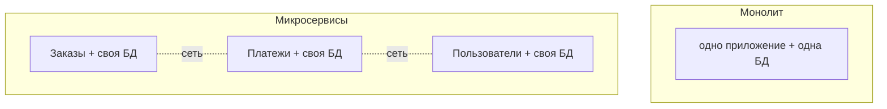

# Монолит vs микросервисы

Два способа организовать приложение: **монолит** — всё в одном приложении;
**микросервисы** — система из многих маленьких сервисов. Частый вопрос — плюсы, минусы
и когда что. Главная мысль: микросервисы — не «лучше», а **другой набор компромиссов**.

## Монолит — всё в одном

Всё приложение — **один** развёртываемый кусок (один процесс, одна кодовая база, одна
БД). Модули внутри просто вызывают друг друга как обычные методы.

**Плюсы:**

- **Просто начать и разрабатывать** — один проект, вызовы внутри — обычные методы.
- **Просто развернуть** — один артефакт.
- **Транзакции** — легко: всё в одной БД, один `@Transactional` покрывает операцию.
- **Отладка и тесты** — всё в одном месте.

**Минусы (когда вырастает):**

- **Тяжело масштабировать точечно** — нельзя добавить мощности только «узкому» модулю,
  масштабируешь всё приложение целиком.
- Кодовая база разрастается, релиз одного — релиз всего; команды мешают друг другу.
- Одна ошибка/утечка может уронить всё приложение.

## Микросервисы — много маленьких сервисов

Приложение разбито на **отдельные сервисы**, каждый про свою область (заказы,
платежи, пользователи), у каждого **своя БД**, общаются по сети (REST/gRPC/брокер).

**Плюсы:**

- **Независимое масштабирование** — нагруженный сервис масштабируешь отдельно.
- **Независимый деплой** — команды релизят свои сервисы самостоятельно.
- **Изоляция отказов** — упал один сервис, остальные могут работать.
- **Разные технологии** под разные задачи.

**Минусы (цена):**

- **Сложность распределённой системы** — сеть ненадёжна, нужны ретраи, таймауты,
  трейсинг.
- **Транзакции через границы сервисов** — обычный `@Transactional` не работает; нужна
  [Saga](../../engineering/design/consistency-saga.md),
  [итоговая согласованность](eventual-consistency.md),
  [идемпотентность](idempotency-distributed.md).
- **Эксплуатация** — много сервисов, нужен оркестратор (Kubernetes), мониторинг,
  общий деплой-конвейер.

## Когда что выбирать

- **Монолит** — по умолчанию, особенно на старте и для небольших/средних систем.
  Проще, быстрее, дешевле. Многие успешные продукты — монолиты.
- **Микросервисы** — когда система и команда **выросли** настолько, что боль монолита
  (совместные релизы, масштабирование, размер) перевешивает сложность распределёнки.

Частый совет — **начинать с монолита** (можно «модульного», с чёткими границами) и
дробить на сервисы по мере необходимости, а не начинать сразу с микросервисов.

## Что запомнить

- Монолит — одно приложение/одна БД: просто разрабатывать, деплоить, транзакции; тяжело
  точечно масштабировать и релизить по частям.
- Микросервисы — много сервисов со своими БД: независимое масштабирование и деплой,
  изоляция отказов; цена — сложность распределёнки (сеть, saga, согласованность,
  эксплуатация).
- Микросервисы не «лучше» — это **другой компромисс**. Начинать разумно с монолита.
