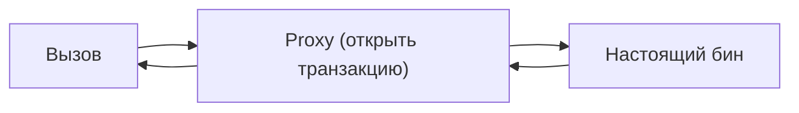

# Какие паттерны использует сам Spring

Хороший вопрос «на понимание»: Spring — это витрина паттернов проектирования.
Умение показать их на примере Spring доказывает, что ты понимаешь паттерны не в
теории. Разберём главные.

## Dependency Injection / IoC

Сердце Spring. Объекты не создают зависимости сами — контейнер **внедряет** их
снаружи. Это реализация принципа [инверсии зависимостей](solid.md) из SOLID.
Подробно — [IoC и DI](../spring/ioc-di.md).

## Singleton

Бины по умолчанию — **синглтоны**: один экземпляр на весь контейнер (см.
[скоупы](../spring/bean-scopes.md)). Spring сам управляет единственностью, тебе не
надо писать классический singleton вручную.

## Factory

Контейнер Spring — это по сути огромная **фабрика бинов**: `BeanFactory` /
`ApplicationContext` создают объекты за тебя. Плюс есть `FactoryBean` — специальный
бин, чья задача — создавать другие бины сложной логикой.

## Proxy

На **прокси** держатся `@Transactional`, кэширование, безопасность, `@Async`. Spring
оборачивает бин в заместителя, который добавляет поведение вокруг вызова метода.
Подробно — [AOP](../spring/aop.md).



## Template Method

Многочисленные классы `...Template` — `JdbcTemplate`, `RestTemplate`,
`KafkaTemplate` — это паттерн **шаблонный метод**: Spring берёт на себя рутину
(открыть/закрыть соединение, обработать ошибки), а ты передаёшь только «интересную»
часть.

```java
// JdbcTemplate: Spring сам открыл соединение, выполнил, закрыл, обработал ошибки
jdbcTemplate.query("SELECT * FROM users", (rs, i) -> new User(rs.getLong("id")));
```

## Observer (наблюдатель)

Механизм **событий** Spring — `ApplicationEvent` и `@EventListener` — это паттерн
наблюдатель: одни компоненты публикуют события, другие на них подписаны и реагируют.

## Adapter, Strategy и другие

- **Adapter** — `HandlerAdapter` в MVC приспосабливает разные виды контроллеров к
  единому механизму.
- **Strategy** — например, разные `ViewResolver`, `HttpMessageConverter` — выбор
  реализации под ситуацию.

## Что запомнить

- **DI/IoC** — внедрение зависимостей (ядро Spring).
- **Singleton** — бины по умолчанию.
- **Factory** — контейнер как фабрика бинов (`BeanFactory`, `FactoryBean`).
- **Proxy** — `@Transactional`, кэш, безопасность (через AOP).
- **Template Method** — `JdbcTemplate`, `RestTemplate` и прочие `...Template`.
- **Observer** — события (`@EventListener`).
