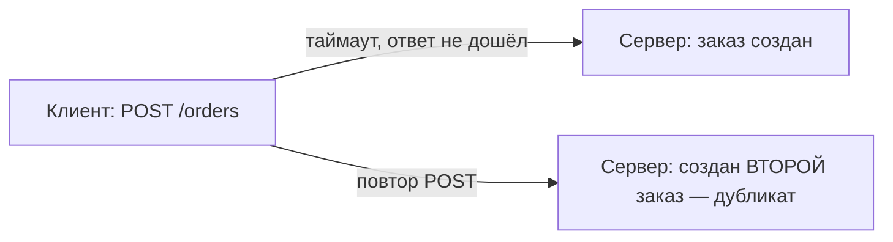

# Идемпотентность HTTP-методов

**Идемпотентность** — свойство операции, при котором **повторный вызов даёт тот же
результат, что и один вызов**. Проще: сделать запрос один раз или пять раз подряд —
состояние на сервере одинаковое. Это важно для надёжности: сеть ненадёжна, и запросы
приходится повторять.

## Определение на примере

- **Идемпотентно:** «установить баланс = 100». Сколько ни повторяй — баланс 100.
- **Не идемпотентно:** «увеличить баланс на 100». Каждый повтор добавляет ещё 100 —
  результат разный.

Ключевое слово — **тот же результат на сервере**, а не «одинаковый ответ». Повторный
`DELETE` может вернуть 404 (уже удалено), но состояние — «объекта нет» — то же.

## Какие HTTP-методы идемпотентны

| Метод | Идемпотентен? | Почему |
|---|---|---|
| `GET` | да | только читает, ничего не меняет |
| `PUT` | да | заменяет ресурс целиком — повтор даёт то же состояние |
| `DELETE` | да | удалил один раз; повтор — ресурс всё так же отсутствует |
| `HEAD`, `OPTIONS` | да | не меняют состояние |
| `POST` | **нет** | обычно создаёт новый ресурс каждый раз |
| `PATCH` | зависит | может быть, а может и нет |

`GET`, `HEAD`, `OPTIONS` вдобавок **безопасны** (safe) — вообще не меняют состояние.

## Почему POST не идемпотентен

`POST /orders` каждый раз создаёт **новый** заказ. Повторили запрос (например, из-за
таймаута и ретрая) — создалось **два** заказа. В этом и проблема.

## Почему это важно на практике

В распределённых системах ответ может не дойти (сеть, таймаут), и клиент **повторяет**
запрос. Если метод идемпотентен — повтор безопасен. Если нет (POST) — можно создать
дубликат.

Чтобы сделать создание безопасным для повторов, используют **ключ идемпотентности**:
клиент присылает уникальный `Idempotency-Key`, сервер запоминает его и на повтор с
тем же ключом **не создаёт** второй заказ, а возвращает результат первого. Подробнее —
[идемпотентность в распределёнке](../patterns/idempotency-distributed.md).

## Что запомнить

- Идемпотентность = повторный вызов не меняет результат на сервере по сравнению с
  одним вызовом.
- Идемпотентны: `GET`, `PUT`, `DELETE`, `HEAD`, `OPTIONS`. **Не** идемпотентен `POST`
  (создаёт новое каждый раз); `PATCH` — как реализуешь.
- Важно из-за повторов запросов в ненадёжной сети; создание защищают **ключом
  идемпотентности**.
