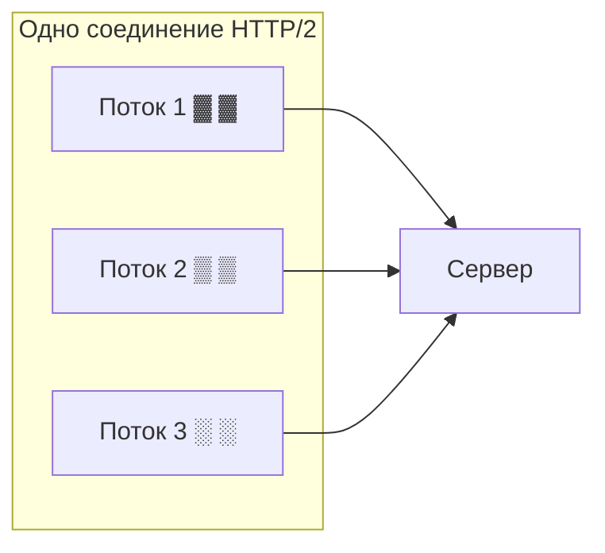

# Версии HTTP и мультиплексирование

HTTP развивался, и каждая версия решала проблему производительности предыдущей.
Понимать различия полезно, а ключевое понятие, которое обязательно спрашивают, —
**мультиплексирование** в HTTP/2. Разберём версии по порядку.

## HTTP/1.0 и HTTP/1.1

**HTTP/1.0** — на каждый запрос **новое TCP-соединение**: установил, отправил
запрос, получил ответ, закрыл. Устанавливать соединение каждый раз дорого.

**HTTP/1.1** (много лет стандарт) добавил:

- **keep-alive** — соединение **переиспользуется** для нескольких запросов, не
  открывается заново каждый раз;
- **chunked transfer** — ответ можно слать частями, не зная заранее размер;
- поддержку кэширования, `Host`-заголовок и т.д.

**Главная проблема HTTP/1.1 — head-of-line blocking.** По одному соединению запросы
идут **строго по очереди**: пока не пришёл ответ на первый запрос, второй ждёт. Один
медленный ответ тормозит остальные.

Браузеры обходили это, открывая **несколько** параллельных соединений к серверу (обычно
6), но это костыль.

## HTTP/2 и мультиплексирование

**HTTP/2** решил проблему очереди. Ключевое нововведение — **мультиплексирование**.

**Мультиплексирование** — это возможность гнать **много запросов и ответов
одновременно по одному TCP-соединению**, не дожидаясь друг друга. Запросы делятся на
маленькие кусочки (**фреймы**), помеченные номером «потока» (stream), и эти кусочки
перемешиваются в одном соединении. На другой стороне их собирают обратно по номерам.

То есть 3 запроса летят **параллельно** по одной трубе, и медленный ответ №1 больше не
блокирует ответы №2 и №3. Не нужно открывать 6 соединений.

Другие улучшения HTTP/2:

- **бинарный формат** вместо текстового — компактнее и быстрее парсится;
- **сжатие заголовков** (HPACK) — заголовки часто повторяются, их сжимают;
- **server push** — сервер может отправить ресурс, не дожидаясь запроса (на практике
  используется редко).

!!! note "Оговорка про head-of-line на уровне TCP"
    HTTP/2 убрал блокировку на уровне HTTP, но осталась на уровне **TCP**: если
    потеряется один TCP-пакет, все потоки в этом соединении ждут его повторной
    доставки. Эту проблему решает уже HTTP/3.

## HTTP/3

**HTTP/3** переносит HTTP с TCP на новый протокол **QUIC**, работающий поверх **UDP**.

Зачем: в QUIC мультиплексирование сделано так, что потеря пакета **не блокирует**
остальные потоки (в отличие от TCP). Плюс соединение устанавливается быстрее
(объединяет рукопожатие TCP и TLS). Итог — быстрее и надёжнее на нестабильных сетях
(мобильный интернет). Внутри — тот же принцип мультиплексирования, но без TCP-очереди.

## Сравнение

| | HTTP/1.1 | HTTP/2 | HTTP/3 |
|---|---|---|---|
| Транспорт | TCP | TCP | QUIC (UDP) |
| Несколько запросов на соединение | по очереди | **мультиплексирование** | мультиплексирование |
| Формат | текст | бинарный | бинарный |
| Head-of-line blocking | да (HTTP) | на уровне TCP | нет |

## Что запомнить

- **HTTP/1.1** — переиспользует соединение (keep-alive), но запросы по нему идут **по
  очереди** (head-of-line blocking).
- **HTTP/2** — **мультиплексирование**: много запросов/ответов **параллельно по одному
  соединению** (через фреймы и потоки), плюс бинарный формат и сжатие заголовков.
- **HTTP/3** — поверх QUIC/UDP, убирает и TCP-блокировку, быстрее на плохих сетях.
- **Мультиплексирование** = несколько независимых обменов по одной трубе
  одновременно, без ожидания друг друга.
