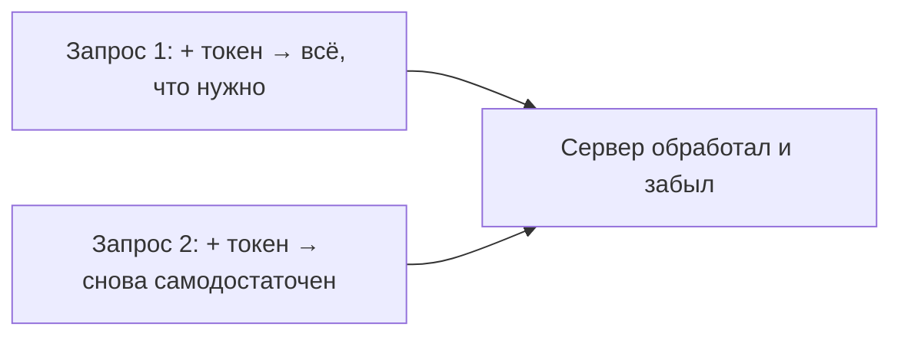

# Что такое REST и его принципы

**REST** (REpresentational State Transfer) — это не технология и не протокол, а
**набор принципов** проектирования веб-API поверх HTTP. Когда API следует этим
принципам, его называют RESTful. Разберём главные идеи.

## Ресурсы и URL

Центральное понятие REST — **ресурс**: некая сущность (пользователь, заказ), у
которой есть адрес — URL. Действия над ресурсами выражаются **HTTP-методами**, а не
глаголами в URL.

```
GET    /users        — получить список пользователей
GET    /users/42     — получить пользователя 42
POST   /users        — создать пользователя
PUT    /users/42     — заменить пользователя 42
PATCH  /users/42     — частично изменить
DELETE /users/42     — удалить
```

Плохо: `/getUser?id=42`, `/createUser`. Хорошо: существительное-ресурс + HTTP-метод.

## Ключевые принципы

- **Клиент-сервер** — клиент (фронт, другой сервис) и сервер разделены и общаются по
  HTTP; можно менять их независимо.
- **Stateless (без состояния)** — сервер **не хранит** состояние клиента между
  запросами. Каждый запрос **самодостаточен**: содержит всё нужное (в т.ч.
  аутентификацию, например токен). Сервер не помнит «прошлый шаг».
- **Единообразный интерфейс** — одинаковые правила: ресурсы по URL, действия
  методами, стандартные коды ответов.
- **Кэшируемость** — ответы можно помечать как кэшируемые (заголовки), чтобы не
  дёргать сервер лишний раз.
- **Многоуровневость** — между клиентом и сервером могут стоять прокси, балансировщики
  — клиент этого не замечает.

## Про stateless подробнее

Это принцип, который чаще всего спрашивают. Stateless значит: сервер не держит
«сессию в памяти» под конкретного клиента. Если нужно знать, кто делает запрос,
клиент **сам** прикладывает это в каждом запросе (обычно токен в заголовке
`Authorization`).



Зачем это нужно: раз сервер ничего не помнит, запросы можно слать на **любой** из
нескольких экземпляров сервера — легко масштабироваться горизонтально. Это одна из
причин, почему REST так удобен для распределённых систем.

## Представления (representations)

Один ресурс может отдаваться в разных **форматах** — чаще всего JSON, но бывает XML.
Клиент говорит, что хочет, через заголовок `Accept`, сервер отдаёт представление
ресурса.

## Что запомнить

- REST — **принципы** проектирования API поверх HTTP, а не технология.
- **Ресурсы** адресуются по URL (существительные), **действия** — HTTP-методами.
- Главные принципы: клиент-сервер, **stateless** (сервер не хранит состояние клиента,
  каждый запрос самодостаточен), единообразный интерфейс, кэшируемость.
- Stateless → легко масштабировать: запрос можно отправить на любой экземпляр сервера.
