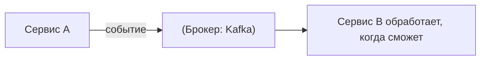

# Как один Spring-сервис вызывает другой

В микросервисах сервисы постоянно ходят друг к другу. Способов несколько — разберём
главные и когда что брать, без лишних деталей.

## Синхронные вызовы (запрос-ответ по HTTP)

Сервис A шлёт HTTP-запрос сервису B и **ждёт ответ**. Инструменты в экосистеме Spring:

- **`RestClient`** — современный синхронный HTTP-клиент (Spring 6.1+). Удобный,
  «текучий» API. Рекомендуемый выбор для новых синхронных вызовов.
- **`RestTemplate`** — старый синхронный клиент. В новых проектах не нужен (по сути
  на пенсии), но в существующих встречается повсеместно.
- **`WebClient`** — **реактивный** (неблокирующий) клиент. Нужен, если проект на
  WebFlux или требуется много параллельных вызовов без блокировки потоков. Умеет и в
  синхронном стиле (`.block()`), но брать его стоит осознанно.
- **OpenFeign** — **декларативный** клиент: описываешь Java-интерфейс с аннотациями,
  реализацию генерирует Feign. Удобно, когда вызовов много — код читается как обычные
  методы.

```java
// OpenFeign: объявил интерфейс — вызываешь как обычный метод
@FeignClient(name = "user-service")
interface UserClient {
    @GetMapping("/users/{id}")
    User getUser(@PathVariable Long id);
}
```

## gRPC — быстрый бинарный вызов

**gRPC** — вызов методов другого сервиса по бинарному протоколу (protobuf) поверх
HTTP/2. Быстрее и компактнее JSON, со строгим контрактом. Берут для **внутреннего**
общения сервисов, где важна скорость и типизация. Наружу (для браузеров) обычно всё
равно REST.

## Асинхронно — через брокер сообщений

Иногда ответ прямо сейчас не нужен — тогда вместо прямого вызова шлют **сообщение/
событие** в брокер (Kafka, RabbitMQ), а другой сервис его обрабатывает, когда сможет.



Это **слабая связанность**: A не ждёт B и не зависит от того, жив ли B сейчас.
Подробнее об этом стиле — в теме про событийную архитектуру.

## Как выбрать

- Нужен **ответ сразу**, простой вызов → `RestClient` (или OpenFeign, если вызовов
  много).
- Реактивный стек / много неблокирующих вызовов → `WebClient`.
- **Внутреннее** общение, важна скорость и строгий контракт → **gRPC**.
- Ответ **не нужен сейчас**, важна независимость сервисов → **брокер** (асинхронно).

## Что запомнить

- Синхронно: **`RestClient`** (новый выбор), OpenFeign (декларативно, когда вызовов
  много), `WebClient` (реактивно), `RestTemplate` (устаревший).
- **gRPC** — быстрый бинарный протокол для внутренних вызовов.
- **Брокер** (Kafka) — асинхронно, когда ответ не нужен сразу и важна слабая
  связанность.
