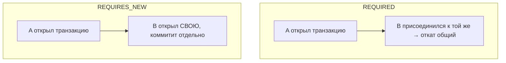

# Propagation и isolation в транзакциях Spring

Два атрибута `@Transactional`, которые часто путают. Если совсем коротко:
**propagation** — что делать, если транзакция **уже идёт**, когда вызвали ещё один
транзакционный метод; **isolation** — насколько транзакция **видит чужие**
незавершённые изменения. Разберём оба.

## Propagation (распространение)

Ситуация: транзакционный метод `A` вызывает другой транзакционный метод `B`.
Открыть для `B` новую транзакцию или пусть работает в той же, что `A`? Это и решает
propagation.

Главные варианты:

- **`REQUIRED`** (по умолчанию) — «нужна транзакция». Если она уже открыта — метод
  **присоединяется** к ней; если нет — открывает новую. В 95% случаев это то, что
  нужно: `A` и `B` работают в одной транзакции, откат откатывает всё вместе.
- **`REQUIRES_NEW`** — «всегда своя новая». `B` **приостанавливает** транзакцию `A`,
  открывает **отдельную** и коммитит её независимо. Даже если `A` потом откатится,
  изменения `B` останутся. Нужно, например, чтобы записать лог/аудит, который
  должен сохраниться независимо от исхода основной операции.
- **`NESTED`** — вложенная транзакция через точку сохранения (savepoint): можно
  откатить только её часть.
- **`SUPPORTS`**, **`MANDATORY`**, **`NEVER`** — более редкие («если есть — используй»,
  «требую существующую», «запрещаю транзакцию»).



## Isolation (изоляция)

Isolation отвечает на вопрос: **что моя транзакция видит из чужих, ещё не
закоммиченных изменений**. Чем строже уровень, тем меньше «аномалий», но тем больше
блокировок и меньше параллелизма.

Уровни (от слабого к строгому):

- **READ UNCOMMITTED** — видит чужие незакоммиченные данные (грязное чтение). Почти
  не используется.
- **READ COMMITTED** — видит только закоммиченное. Часто **по умолчанию** (например,
  в PostgreSQL).
- **REPEATABLE READ** — в рамках транзакции повторное чтение даёт тот же результат.
- **SERIALIZABLE** — самый строгий, транзакции как будто идут по очереди.

Подробный разбор уровней и аномалий (dirty / non-repeatable / phantom read) — в
отдельном вопросе про [уровни изоляции](../sql/isolation-levels.md). В Spring уровень
задают так:

```java
@Transactional(isolation = Isolation.REPEATABLE_READ)
```

По умолчанию (`Isolation.DEFAULT`) берётся уровень, настроенный в самой БД.

## Как не путать

- **Propagation** — про **границы** транзакции: одна общая или новая отдельная.
- **Isolation** — про **видимость** чужих изменений внутри транзакции.

## Что запомнить

- Propagation `REQUIRED` (по умолчанию) — присоединиться к текущей транзакции или
  создать новую; `REQUIRES_NEW` — всегда отдельная, коммитится независимо.
- Isolation — насколько видны чужие незакоммиченные изменения; чаще всего
  READ COMMITTED.
- Propagation — про границы, isolation — про видимость.
