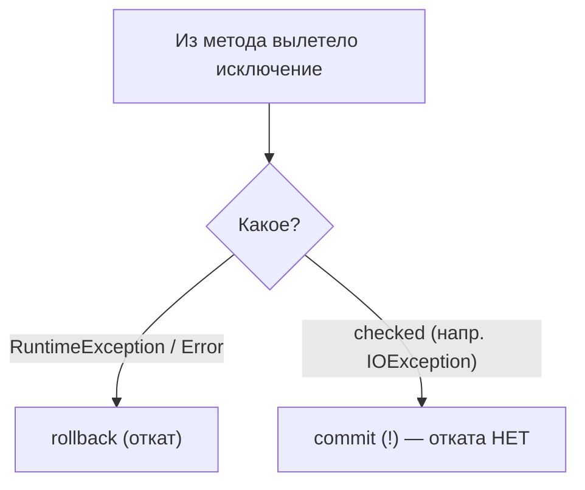

# Исключения и откат транзакции

Логично ожидать: «вылетело исключение → транзакция откатилась». Но в Spring это
верно **не для всех** исключений. Здесь кроется частая ошибка, поэтому разберём
правило отката подробно.

## Правило по умолчанию

Spring откатывает транзакцию **только при `RuntimeException` (unchecked) и `Error`**.
При **проверяемом (checked) исключении** транзакция по умолчанию **коммитится**, а не
откатывается.



Пример ловушки:

```java
@Transactional
public void save() throws IOException {
    repo.save(order);          // записали в БД
    sendFile();                // бросает checked IOException
    // транзакция закоммитится, order останется в БД, хотя дальше всё сломалось
}
```

Почему так исторически: unchecked-исключения считаются «программными ошибками»
(что-то пошло не так → откатываем), а checked — «ожидаемыми ситуациями», которые код
якобы обрабатывает сам.

## Как управлять откатом

**Откатывать и на checked-исключениях** — через `rollbackFor`:

```java
@Transactional(rollbackFor = Exception.class)   // откат на любом исключении
public void save() throws IOException { ... }
```

**Наоборот, не откатывать на конкретном unchecked** — через `noRollbackFor`:

```java
@Transactional(noRollbackFor = SomeBusinessException.class)
```

## Вторая ловушка: проглоченное исключение

Если исключение поймано внутри метода и **не проброшено**, прокси о нём не узнает —
и сделает commit:

```java
@Transactional
public void save() {
    try {
        repo.save(order);
        risky();
    } catch (Exception e) {
        log.error("ошибка", e);   // проглотили → прокси видит успех → commit
    }
}
```

Чтобы транзакция откатилась, исключение должно **дойти до прокси** (быть проброшено),
либо нужно вручную пометить транзакцию на откат:

```java
TransactionAspectSupport.currentTransactionStatus().setRollbackOnly();
```

## Что запомнить

- По умолчанию откат — **только на unchecked** (`RuntimeException`/`Error`).
- На **checked**-исключениях по умолчанию **commit** — если нужен откат, ставь
  `rollbackFor = Exception.class`.
- Если исключение **поймано и не проброшено**, отката не будет — прокси его не видит.
- Принудительно откатить можно через `setRollbackOnly()`.
