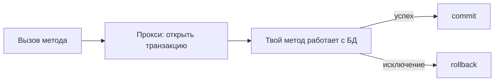

# Как работает `@Transactional`

`@Transactional` — аннотация, которая оборачивает метод в **транзакцию базы данных**:
всё, что метод изменил в БД, либо сохраняется целиком, либо целиком откатывается при
ошибке. Разберём, как Spring это делает и какие есть настройки.

## Что происходит под капотом

`@Transactional` работает через **прокси** (см. [AOP](../spring/aop.md)). Spring
оборачивает бин в обёртку, и когда вызывают транзакционный метод, прокси:

1. **открывает** транзакцию (берёт соединение с БД, выключает автокоммит);
2. вызывает **сам метод** (твою логику);
3. если метод завершился нормально — **commit** (зафиксировать изменения);
4. если вылетело исключение — **rollback** (откатить всё).



Соединение с БД на время транзакции хранится в
[`ThreadLocal`](../concurrency/threadlocal.md) — поэтому весь код внутри метода
работает в **одной** транзакции, даже если он вызывает репозитории.

## Основные атрибуты

```java
@Transactional(readOnly = true, propagation = Propagation.REQUIRED, timeout = 5)
public User getUser(Long id) { ... }
```

- **`readOnly`** — пометка «только чтение». Говорит, что метод ничего не меняет.
  Даёт оптимизации: Hibernate может не отслеживать изменения объектов (не делать
  dirty checking), а БД/драйвер — работать эффективнее. Ставят на методы-читалки.
- **`propagation`** — как вести себя, если транзакция **уже открыта** (продолжить её
  или начать новую). Подробно — [propagation и isolation](propagation-isolation.md).
- **`isolation`** — уровень изоляции транзакции (насколько она видит чужие
  незакоммиченные изменения).
- **`rollbackFor`** — при каких исключениях откатывать (по умолчанию откат только на
  unchecked-исключениях, см. [исключения и откат](rollback-exceptions.md)).
- **`timeout`** — максимальное время транзакции.

## Как этим пользоваться правильно

- Вешают `@Transactional` обычно на **методы сервиса** (слой бизнес-логики), а не на
  контроллеры или репозитории.
- Один метод сервиса = одна бизнес-операция = одна транзакция. Если внутри он
  меняет несколько таблиц — либо всё сохранится, либо всё откатится.
- Методы-читалки помечают `@Transactional(readOnly = true)`.

## Что запомнить

- `@Transactional` оборачивает метод в транзакцию: успех → commit, исключение →
  rollback.
- Работает через **прокси**; соединение живёт в `ThreadLocal`, поэтому вся работа
  внутри — в одной транзакции.
- `readOnly = true` — для методов чтения, включает оптимизации.
- Вешать на сервисный слой.
