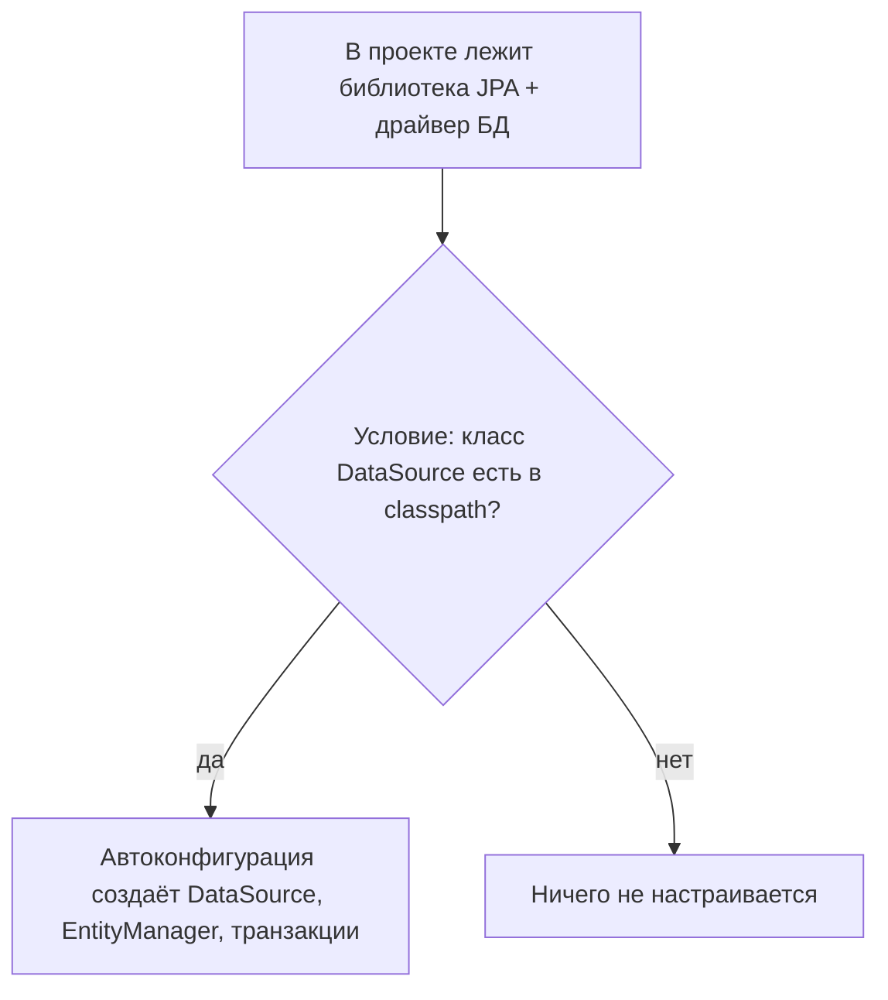

# Автоконфигурация Spring Boot: в чём суть

Это, пожалуй, главная «магия» Spring Boot, и её важно понять по-настоящему, а не
заучить. Суть в одном предложении: **Spring Boot сам настраивает приложение,
догадываясь о нужных настройках по тому, какие библиотеки лежат в проекте**. Дальше
разберём, что это значит и как работает.

## Проблема, которую решает автоконфигурация

До Spring Boot, чтобы поднять простое веб-приложение с базой, нужно было **руками**
описать кучу объектов: настроить `DataSource`, `EntityManager`, менеджер
транзакций, `DispatcherServlet`, конвертеры JSON и т.д. Это десятки строк
конфигурации, почти одинаковых из проекта в проект.

Автоконфигурация говорит: «Ты подключил библиотеку для работы с базой? Значит, тебе
наверняка нужен настроенный `DataSource` — я его создам сам, с разумными
настройками. Не понравится — переопределишь.»

## Суть: «есть библиотека → настроим её сама»

Ключевая идея — **условная настройка**. Spring Boot содержит множество готовых
классов-настроек (автоконфигураций), и каждая срабатывает **только при условии**,
что в проекте есть соответствующая библиотека.

Работает это через аннотации-условия, например:

- `@ConditionalOnClass` — включить настройку, только если такой класс есть в проекте
  (то есть библиотека подключена);
- `@ConditionalOnMissingBean` — создать бин, **только если ты не создал свой**. Вот
  почему автоконфигурацию так легко переопределить: объявил свой `DataSource` — и
  Boot отступает.

## Как это включается: стартеры и одна аннотация

**Стартеры** (starters) — это готовые наборы зависимостей. Например,
`spring-boot-starter-web` тянет за собой Spring MVC, встроенный Tomcat, Jackson —
всё, что нужно для веба, одной строкой. Ты добавляешь стартер — в проекте появляются
нужные библиотеки — автоконфигурация видит их и настраивает.

Запускает весь механизм аннотация **`@SpringBootApplication`**, а точнее входящая в
неё **`@EnableAutoConfiguration`**. Она говорит: «просмотри все известные
автоконфигурации и примени те, чьи условия выполнены».

## Как этим управлять

- **Переопределить** — просто объяви свой бин; благодаря `@ConditionalOnMissingBean`
  Boot не будет создавать свой.
- **Подкрутить настройки** — через `application.yml`/`application.properties`
  (например, `spring.datasource.url=...`). Автоконфигурация читает эти свойства.
- **Отключить лишнее** — исключить конкретную автоконфигурацию:
  `@SpringBootApplication(exclude = DataSourceAutoConfiguration.class)`.
- **Посмотреть, что применилось** — запуск с `--debug` печатает отчёт: какие
  автоконфигурации сработали, а какие нет и почему.

## Что запомнить

- Автоконфигурация = Spring Boot **сам настраивает приложение** по тому, какие
  библиотеки есть в проекте.
- Механизм — **условия**: настройка применяется, только если есть нужный класс
  (`@ConditionalOnClass`) и если ты не задал своё (`@ConditionalOnMissingBean`).
- **Стартеры** приносят библиотеки, `@EnableAutoConfiguration` (внутри
  `@SpringBootApplication`) запускает подбор настроек.
- Управляешь через свои бины, `application.yml` и `exclude`.
