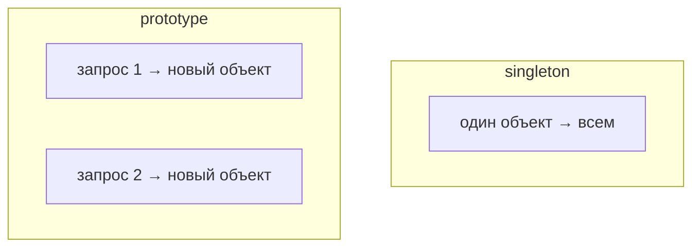

# Скоупы бинов

**Скоуп** (scope) бина — это ответ на вопрос «сколько экземпляров этого бина создаст
Spring и как долго они живут». По умолчанию бин один на всё приложение, но бывают и
другие варианты. Разберём главные.

## `singleton` — один на всё приложение (по умолчанию)

Если ничего не указывать, бин — **singleton**: контейнер создаёт **ровно один**
экземпляр и отдаёт его всем, кто просит.

```java
@Service   // это singleton по умолчанию
class UserService { ... }
```

Все контроллеры, которым нужен `UserService`, получат **один и тот же** объект.

!!! warning "Singleton должен быть без изменяемого состояния"
    Раз экземпляр один и им пользуются много потоков одновременно, хранить в нём
    изменяемые поля (которые меняются между запросами) опасно — будут гонки.
    Singleton-бины делают **stateless**: без изменяемого состояния.

## `prototype` — новый экземпляр на каждый запрос бина

При скоупе **prototype** контейнер создаёт **новый** экземпляр **каждый раз**, когда
этот бин запрашивают.

```java
@Service
@Scope("prototype")
class ReportBuilder { ... }   // каждый, кто попросит, получит свежий объект
```

Нужен, когда у бина есть состояние, своё для каждого использования.



## Веб-скоупы

В веб-приложениях есть ещё скоупы, привязанные к запросу/сессии:

- **`request`** — свой экземпляр на каждый HTTP-запрос.
- **`session`** — свой экземпляр на HTTP-сессию (на пользователя).
- **`application`** — один на всё веб-приложение.

Они нужны редко; на практике 99% бинов — singleton.

## Подвох: prototype внутри singleton

Частая ловушка: если внедрить prototype-бин в singleton **через обычное поле**, он
создастся **один раз** (когда создавался singleton) и дальше не будет обновляться.
Синглтон-то создаётся один раз — значит, и внедрение произойдёт один раз. Если нужен
свежий экземпляр каждый раз, берут его через `ObjectProvider` или ищут в контексте.

## Что запомнить

- Скоуп = сколько экземпляров и как долго живут.
- **singleton** (по умолчанию) — один на всё приложение; делай его без изменяемого
  состояния.
- **prototype** — новый экземпляр на каждый запрос бина.
- Веб-скоупы (`request`, `session`) — редко.
- Prototype внутри singleton через поле не «освежается» — нужен `ObjectProvider`.
