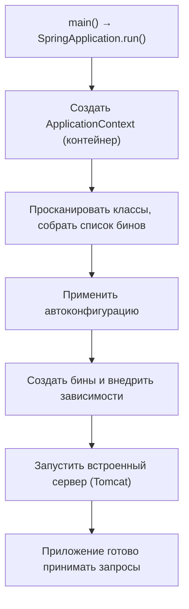

# Как запускается Spring Boot приложение

Вопрос про то, что происходит между `main()` и моментом, когда приложение готово
принимать запросы. Знать все детали не нужно, но общую последовательность полезно
понимать — она часто всплывает.

## Точка входа

Всё начинается с обычного `main`, который передаёт управление Spring Boot:

```java
@SpringBootApplication
public class App {
    public static void main(String[] args) {
        SpringApplication.run(App.class, args);   // отсюда всё и запускается
    }
}
```

`SpringApplication.run(...)` и делает всю работу по подъёму приложения.

## Основные этапы



Чуть подробнее, что происходит:

1. **Определяется тип приложения** (веб или нет) — по тому, какие библиотеки в
   проекте.
2. **Создаётся `ApplicationContext`** — тот самый IoC-контейнер.
3. **Сканирование компонентов** — Spring ищет классы с `@Component`, `@Service`,
   `@Controller`, `@Configuration` и составляет «рецепты» бинов.
4. **Автоконфигурация** — применяются подходящие настройки (см.
   [автоконфигурация](autoconfiguration.md)).
5. **Создание бинов** — контейнер создаёт бины и внедряет зависимости (проходит их
   [жизненный цикл](ioc-di.md)).
6. **Запуск встроенного сервера** — для веб-приложения поднимается встроенный
   Tomcat/Jetty; регистрируется `DispatcherServlet`.
7. **`ApplicationRunner`/`CommandLineRunner`** — если они есть, выполняется твой код,
   который надо запустить после старта.
8. **Готовность** — приложение слушает порт и принимает запросы.

## Полезные детали

- **Встроенный сервер** — важная особенность Boot: Tomcat идёт **внутри** приложения,
  не нужно отдельно ставить сервер и деплоить war. Получается обычный
  исполняемый jar.
- **События старта** — Spring публикует события (`ApplicationStartedEvent`,
  `ApplicationReadyEvent`), на которые можно подписаться, чтобы что-то сделать в
  нужный момент.
- **`CommandLineRunner`** — удобное место для кода, который надо выполнить один раз
  при старте (прогреть кэш, проверить связь с внешним сервисом).

## Что запомнить

- Всё запускает `SpringApplication.run()` из `main`.
- Порядок: создать контейнер → просканировать бины → автоконфигурация → создать
  бины → поднять встроенный сервер → готово.
- Сервер (Tomcat) **встроен** в приложение — на выходе исполняемый jar.
- После старта можно выполнить свой код через `CommandLineRunner`/`ApplicationRunner`.
