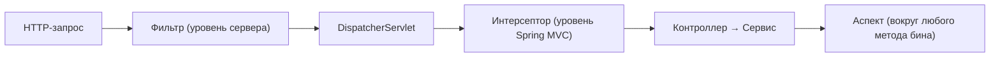

# Фильтр vs интерсептор vs аспект

Три механизма, которые умеют «вклиниться» в обработку и сделать что-то до/после.
Путаница между ними частая. Главное различие — **на каком уровне** и на каком этапе
они работают. Пойдём снаружи внутрь.

## Три уровня одного запроса

Запрос проходит как бы сквозь три слоя, и на каждом свой перехватчик:



## Фильтр (Filter)

- **Уровень:** сервлет-контейнер (Tomcat), **до** того как запрос вообще попал в
  Spring MVC.
- **Видит:** «сырые» `HttpServletRequest`/`HttpServletResponse` — байты, заголовки. О
  контроллерах и бинах ничего не знает.
- **Для чего:** самые общие вещи на входе/выходе — CORS, сжатие, логирование всех
  запросов, аутентификация (Spring Security построен на фильтрах).

```java
@Component
class LogFilter implements Filter {
    public void doFilter(ServletRequest req, ServletResponse res, FilterChain chain) {
        // до
        chain.doFilter(req, res);   // передать дальше
        // после
    }
}
```

## Интерсептор (HandlerInterceptor)

- **Уровень:** внутри Spring MVC, **после** `DispatcherServlet`, вокруг вызова
  контроллера.
- **Знает:** какой контроллер будет вызван (`handler`). Уже в мире Spring.
- **Для чего:** то, что связано с контроллерами — проверка прав на уровне MVC,
  замер времени работы контроллера, добавление общих атрибутов.
- **Методы:** `preHandle` (до контроллера), `postHandle` (после), `afterCompletion`
  (в самом конце).

## Аспект (Aspect, AOP)

- **Уровень:** вокруг вызова **любого метода любого бина**, не только веб — сервисы,
  репозитории.
- **Знает:** метод, его аргументы, результат.
- **Для чего:** сквозная логика на уровне методов — транзакции, логирование
  сервисов, метрики, кэш. Подробно — [AOP](aop.md).

## Сравнение

| | Фильтр | Интерсептор | Аспект |
|---|---|---|---|
| Уровень | сервер (до Spring) | Spring MVC | любой бин/метод |
| Работает с | сырой запрос/ответ | запрос + известный контроллер | вызов метода + аргументы |
| Только веб? | да | да | нет, любые методы |
| Типичное применение | CORS, security, сжатие | проверки вокруг контроллеров | транзакции, логи сервисов |

## Как выбрать

- Нужно поймать **все** запросы на самом входе, работать с сырым запросом → **фильтр**.
- Нужно что-то **вокруг контроллеров**, зная какой контроллер → **интерсептор**.
- Нужно обернуть **методы сервисов/репозиториев** (не веб) → **аспект**.

## Что запомнить

- Порядок снаружи внутрь: **фильтр → интерсептор → аспект**.
- Фильтр — уровень сервера, сырой запрос, до Spring.
- Интерсептор — внутри Spring MVC, вокруг контроллера.
- Аспект — вокруг любого метода бина (транзакции, логи сервисов).
