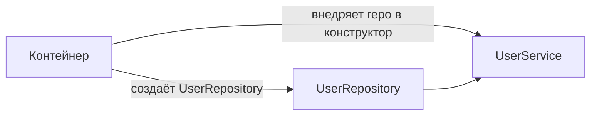
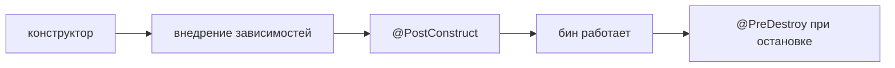

# IoC и DI; контейнер, бины и их жизненный цикл

Это фундамент всего Spring. **IoC** (инверсия управления) — общий принцип, **DI**
(внедрение зависимостей) — конкретный способ его реализовать. Разберём оба и заодно
жизненный цикл бина.

## IoC — «не ты создаёшь объекты, а контейнер»

Обычно объекты и их зависимости создаёшь ты сам:

```java
UserRepository repo = new UserRepository();
UserService service = new UserService(repo);   // сам создал, сам связал
```

При **Inversion of Control** управление создаём и связыванием объектов
**переворачивается**: этим занимается не твой код, а **контейнер** Spring. Ты лишь
описываешь, какие объекты нужны, — а контейнер их создаёт и соединяет.

Такие объекты, которыми управляет контейнер, называются **бинами** (beans).

## DI — как именно контейнер отдаёт зависимости

**Dependency Injection** — способ реализации IoC: контейнер **сам передаёт** объекту
его зависимости, а не объект их ищет. Три вида внедрения:

```java
// 1. Через конструктор — рекомендуемый способ
@Service
class UserService {
    private final UserRepository repo;
    UserService(UserRepository repo) {   // Spring подставит сюда бин
        this.repo = repo;
    }
}
```

- **Через конструктор** — предпочтительно: зависимости можно сделать `final`, объект
  всегда создаётся в готовом состоянии, легко тестировать.
- **Через сеттер** — для необязательных зависимостей.
- **Через поле** (`@Autowired` над полем) — коротко, но так не рекомендуют: нельзя
  `final`, тяжелее тестировать без Spring.



## Что даёт такой подход

- **Слабая связанность** — классы не создают зависимости сами, а получают готовые;
  легко подменить реализацию.
- **Тестируемость** — в тесте можно передать мок вместо настоящего бина.
- **Централизованное управление** — контейнер знает про все объекты и их связи.

## Жизненный цикл бина

Каждый бин проходит путь под управлением контейнера:

1. **Создание** — контейнер вызывает конструктор.
2. **Внедрение зависимостей** — подставляет другие бины.
3. **Инициализация** — вызываются `@PostConstruct` и подобные хуки (тут можно
   доготовить бин); здесь же бин могут обернуть в AOP-прокси.
4. **Использование** — бин работает, обслуживает запросы.
5. **Уничтожение** — при остановке приложения вызывается `@PreDestroy` (закрыть
   ресурсы).



По умолчанию бины — **синглтоны**: контейнер создаёт **один** экземпляр на всё
приложение и отдаёт его всем (подробнее — [скоупы бинов](bean-scopes.md)).

## Что запомнить

- **IoC** — объекты создаёт и связывает контейнер, а не твой код.
- **DI** — конкретный способ: контейнер сам передаёт зависимости; лучший вариант —
  через конструктор.
- Плюсы: слабая связанность, тестируемость.
- Жизненный цикл: создание → внедрение → `@PostConstruct` → работа → `@PreDestroy`.
