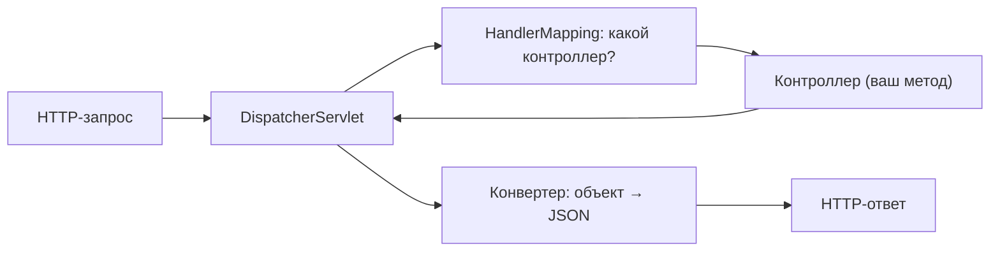

# Путь HTTP-запроса в Spring MVC

Вопрос про то, что происходит внутри Spring, когда приходит HTTP-запрос: от момента,
как его принял сервер, до момента, как ушёл ответ. В центре всего — один особый
объект, **`DispatcherServlet`**.

## `DispatcherServlet` — единая точка входа

Все запросы к приложению попадают в **`DispatcherServlet`** (его ещё называют «front
controller» — единый контроллер на входе). Он сам ничего бизнесового не делает, а
**распределяет** запрос по нужным компонентам и собирает ответ.

## Шаги обработки

1. **Запрос приходит в `DispatcherServlet`.** Перед этим он может пройти через
   [фильтры](filter-interceptor-aspect.md) сервера.
2. **`HandlerMapping` ищет обработчик.** По URL и HTTP-методу определяется, какой
   метод какого контроллера должен обработать запрос (по `@GetMapping`,
   `@PostMapping` и т.п.).
3. **Работают интерсепторы (`preHandle`).** До контроллера могут вклиниться
   интерсепторы (например, проверить авторизацию).
4. **Вызывается метод контроллера.** Spring подготавливает аргументы: достаёт
   параметры из URL, разбирает тело запроса в объект (`@RequestBody`), проводит
   валидацию. Контроллер выполняет логику и возвращает результат.
5. **Результат превращается в ответ.** Для REST (`@RestController`) объект
   **сериализуется в JSON** через `HttpMessageConverter` (Jackson). Для обычного MVC
   `ViewResolver` находит HTML-шаблон.
6. **Ответ уходит клиенту**, по пути снова через интерсепторы (`afterCompletion`) и
   фильтры.

## Ключевые участники

- **`DispatcherServlet`** — диспетчер, единая точка входа и координатор.
- **`HandlerMapping`** — сопоставляет URL → метод контроллера.
- **Контроллер** — твой код с `@GetMapping`/`@PostMapping`.
- **`HttpMessageConverter`** — превращает объект в JSON и обратно.
- **`HandlerExceptionResolver`** — если вылетело исключение, превращает его в
  корректный ответ (тут работает `@ExceptionHandler`/`@ControllerAdvice`).

## Что запомнить

- Все запросы проходят через один **`DispatcherServlet`** — он раздаёт работу и
  собирает ответ.
- Путь: фильтры → `DispatcherServlet` → `HandlerMapping` находит контроллер →
  интерсепторы → метод контроллера → конвертация результата в JSON → ответ.
- За JSON отвечает `HttpMessageConverter` (Jackson), за ошибки — механизм
  `@ExceptionHandler`/`@ControllerAdvice`.
