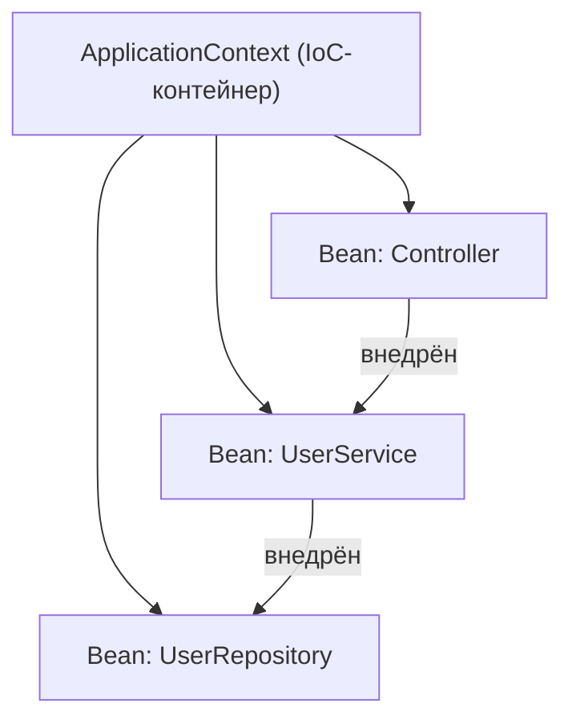

# Как устроен Spring Framework изнутри

Spring — это большой набор модулей, но в сердце у него одна идея: **контейнер**,
который сам создаёт объекты, связывает их между собой и управляет их жизнью. Всё
остальное (веб, транзакции, безопасность) навешивается сверху. Разберём главные
компоненты и как они взаимодействуют.

## Ядро: IoC-контейнер

Главная часть Spring — **IoC-контейнер** (он же `ApplicationContext`). Его работа:

- прочитать, какие объекты нужны приложению (**бины**);
- создать их;
- **внедрить** им зависимости (связать друг с другом);
- держать их у себя и отдавать по запросу.

То есть не ты создаёшь объекты через `new` и сам их связываешь, а контейнер делает
это за тебя. Это называется **Inversion of Control** (инверсия управления) — см.
[IoC и DI](ioc-di.md).

## Из чего складывается Spring

- **Core / Beans** — сам контейнер: создание бинов и внедрение зависимостей.
- **Context** — `ApplicationContext`, надстройка над контейнером с событиями,
  ресурсами, интернационализацией.
- **AOP** — аспектно-ориентированное программирование: возможность «обернуть»
  методы дополнительным поведением (логирование, транзакции). См. [AOP](aop.md).
- **Модули поверх ядра** — Spring MVC (веб), Spring Data (базы), Spring Security
  (безопасность), Spring Boot (автоконфигурация и запуск). Все они опираются на тот
  же контейнер бинов.

## Как компоненты взаимодействуют

При старте контейнер:

1. **сканирует** классы, помеченные `@Component`/`@Service`/`@Repository`/
   `@Controller`, и конфигурации с `@Bean`;
2. составляет список бинов (`BeanDefinition` — «рецепт» каждого бина);
3. создаёт бины и **внедряет** зависимости в правильном порядке;
4. даёт расширениям вклиниться через `BeanPostProcessor` (например, чтобы обернуть
   бин AOP-прокси для транзакций);
5. после этого приложение готово, и бины можно использовать.

Расширяемость держится на нескольких «точках вклинивания»: `BeanPostProcessor`
(доработать бин при создании), `BeanFactoryPostProcessor` (доработать рецепты),
события контекста. Именно через них работают транзакции, безопасность и Spring Boot.

## Что запомнить

- Сердце Spring — **IoC-контейнер** (`ApplicationContext`): создаёт бины, связывает
  их и управляет их жизнью.
- Ты описываешь бины и зависимости — контейнер делает остальное.
- Веб, данные, безопасность — модули **поверх** этого ядра, использующие те же бины.
- Расширяемость — через `BeanPostProcessor` и подобные хуки (на них стоят транзакции
  и AOP).
