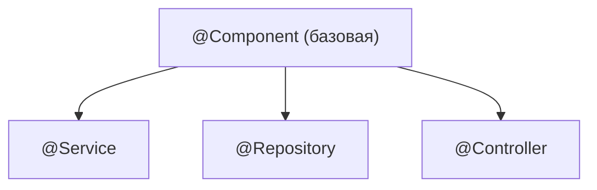

# `@Component`, `@Service`, `@Repository`, `@Controller` — разница

Все четыре аннотации делают одно и то же базовое дело: помечают класс как **бин**,
чтобы Spring его нашёл при сканировании и создал. Разница в основном **смысловая** —
они показывают роль класса. Но у двух из них есть и техническое отличие.

## Общее: все они — «сделай меня бином»

`@Service`, `@Repository` и `@Controller` — это, по сути, **специализированные
`@Component`**. Внутри каждой из них стоит `@Component`. Для контейнера это значит
одно: «найди этот класс при сканировании и зарегистрируй как бин».

## Разница — в роли (для читателя кода)

Аннотации выбирают по **слою**, к которому относится класс — это делает код
понятнее:

- **`@Component`** — общий вариант, «просто бин», когда класс не подходит под роль
  ниже (утилита, вспомогательный компонент).
- **`@Service`** — класс с **бизнес-логикой** (сервисный слой).
- **`@Repository`** — класс для **доступа к данным** (работа с БД, DAO).
- **`@Controller`** — класс, принимающий **веб-запросы** (слой представления).

Технически `@Service` и `@Component` ведут себя одинаково — разница только в том, что
человек, читающий код, сразу видит назначение класса.

## Где отличие не только смысловое

- **`@Repository`** — не просто метка. Spring **перехватывает исключения** доступа к
  данным и переводит специфичные для JDBC/JPA ошибки в единую иерархию
  `DataAccessException`. То есть код выше не зависит от того, какая именно БД/технология
  под капотом.
- **`@Controller`** — участвует в веб-механизме Spring MVC: его методы становятся
  обработчиками запросов. Родственная `@RestController` — это `@Controller` +
  `@ResponseBody` (возвращает данные как JSON, а не имя странички).

## Что запомнить

- Все четыре помечают класс как бин; `@Service`/`@Repository`/`@Controller` — это
  `@Component` с уточнённой ролью.
- Выбираешь по слою: `@Service` — логика, `@Repository` — данные, `@Controller` —
  веб, `@Component` — всё остальное.
- Отличия по делу: `@Repository` переводит ошибки БД в `DataAccessException`,
  `@Controller` включается в обработку веб-запросов.
