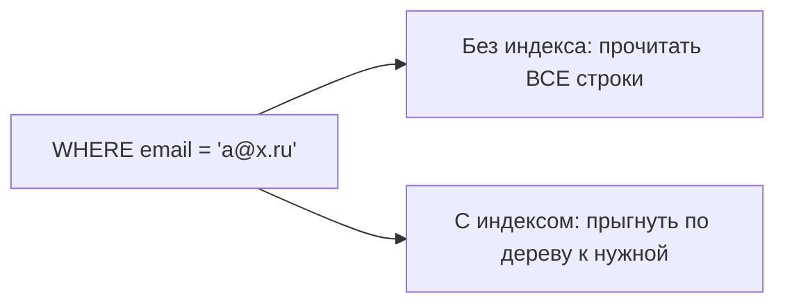
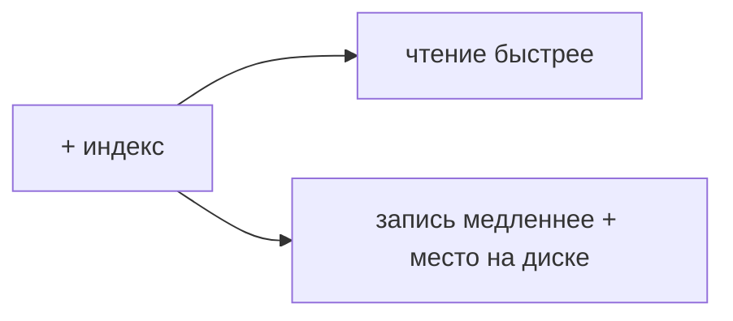

# Индексы: как ускоряют, когда не работают, чем платим

Индекс — это структура, которая помогает БД **быстро находить** строки, не читая всю
таблицу. Аналогия — предметный указатель в конце книги: вместо перелистывания всех
страниц ты по алфавиту находишь нужную. Разберём, как это работает и в чём подвох.

## Как индекс ускоряет поиск

Без индекса, чтобы найти строку по условию, БД делает **full scan** — читает **все**
строки таблицы и проверяет каждую. На миллионе строк это медленно.

Индекс (обычно **B-дерево**) хранит значения колонки **отсортированными** и с
указателями на строки. Поиск по нему — как поиск в отсортированном справочнике: за
несколько шагов, а не перебором. Сложность падает с O(n) до примерно O(log n).



```sql
CREATE INDEX idx_users_email ON users(email);
-- теперь SELECT ... WHERE email = ? быстрый
```

Индексы помогают не только для `WHERE`, но и для `JOIN` (по ключам соединения),
`ORDER BY` (данные уже отсортированы) и поиска по диапазону (`age > 18`).

## Когда индекс НЕ работает

Индекс есть, но БД им **не пользуется** — частая причина медленных запросов:

- **Функция/преобразование над колонкой**: `WHERE LOWER(email) = ...` — индекс по
  `email` не подойдёт (нужен индекс по `LOWER(email)`).
- **Условие не на первую колонку составного индекса.** Индекс по `(a, b)` работает
  для поиска по `a` и по `a AND b`, но **не** по одному `b` (правило «левого
  префикса»).
- **`LIKE '%текст'`** с ведущим `%` — обычный B-дерево-индекс бесполезен (не с чего
  начать).
- **Мало уникальных значений** (например, колонка «пол»): БД решит, что проще
  прочитать таблицу целиком, чем прыгать по индексу.
- **Маленькая таблица** — full scan и так быстр, индекс не нужен.

Проверяют, использовался ли индекс, командой **`EXPLAIN`** (`EXPLAIN ANALYZE`) — она
показывает план запроса: `Index Scan` (хорошо) или `Seq Scan` (полный проход).

## Чем платим за индексы

Индексы не бесплатны — иначе их вешали бы на всё:

- **Замедляют запись.** При каждом `INSERT`/`UPDATE`/`DELETE` нужно обновлять ещё и
  все индексы таблицы. Много индексов → медленная запись.
- **Занимают место** на диске.
- **Требуют поддержки** — лишние/неиспользуемые индексы только вредят.



Поэтому индексы ставят **осознанно**: на колонки, по которым часто ищут/джойнят/
сортируют, а не на все подряд.

## Что запомнить

- Индекс — «указатель», помогает найти строки без полного прохода таблицы (B-дерево,
  ~O(log n) вместо O(n)).
- Не сработает при функции над колонкой, `LIKE '%...'`, не-первой колонке составного
  индекса, малой селективности.
- Проверить использование — `EXPLAIN` (`Index Scan` vs `Seq Scan`).
- Цена — **медленнее запись** и место на диске; ставить индексы по делу.
