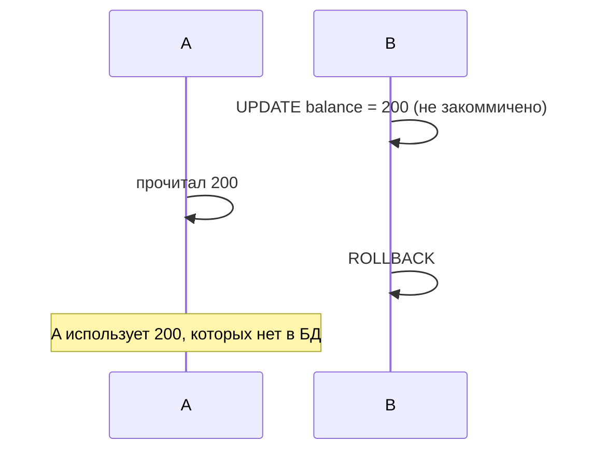
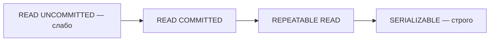

# Уровни изоляции транзакций и аномалии

Когда несколько транзакций работают **одновременно**, они могут мешать друг другу и
приводить к странным результатам — **аномалиям**. Уровни изоляции — это «настройка
строгости»: чем строже, тем меньше аномалий, но тем меньше параллелизма. Разберём
аномалии и уровни, которые от них защищают.

## Три аномалии

Разберём на примере: транзакция A читает данные, транзакция B их меняет.

**1. Dirty read (грязное чтение)** — A читает данные, которые B **изменил, но ещё не
закоммитил**. Если B откатится, A прочитала то, чего «никогда не было».



**2. Non-repeatable read (неповторяющееся чтение)** — A читает строку дважды, а между
чтениями B **изменил и закоммитил** её. Два чтения одной строки дали **разные**
значения.

**3. Phantom read (фантомное чтение)** — A дважды выполняет запрос с условием
(`WHERE age > 18`), а между ними B **добавил/удалил** строки, попадающие под условие.
Появились/исчезли «фантомные» строки — изменился **набор** строк, а не значение.

## Уровни изоляции

От слабого к строгому — каждый следующий убирает ещё одну аномалию:

| Уровень | Dirty read | Non-repeatable | Phantom |
|---|---|---|---|
| READ UNCOMMITTED | возможен | возможен | возможен |
| READ COMMITTED | нет | возможен | возможен |
| REPEATABLE READ | нет | нет | возможен* |
| SERIALIZABLE | нет | нет | нет |

- **READ UNCOMMITTED** — видно даже незакоммиченное. Почти не используется.
- **READ COMMITTED** — видно только закоммиченное. **По умолчанию в PostgreSQL**.
  Самый частый на практике.
- **REPEATABLE READ** — в рамках транзакции повторное чтение одной строки стабильно.
  (*В PostgreSQL этот уровень защищает и от фантомов благодаря
  [MVCC](mvcc.md).)
- **SERIALIZABLE** — самый строгий: транзакции идут так, будто по очереди. Максимум
  защиты, минимум параллелизма.



## Компромисс

Чем строже уровень — тем **больше блокировок / проверок** и меньше одновременных
транзакций проходит. Поэтому не берут SERIALIZABLE «на всякий случай» — по умолчанию
живут на READ COMMITTED, а уровень повышают точечно, где это реально нужно.

## Как задать в Spring

```java
@Transactional(isolation = Isolation.REPEATABLE_READ)
public void process() { ... }
```

По умолчанию (`Isolation.DEFAULT`) используется уровень, настроенный в самой БД.

## Что запомнить

- Аномалии: **dirty read** (чужое незакоммиченное), **non-repeatable read** (строка
  изменилась между чтениями), **phantom read** (изменился набор строк по условию).
- Уровни от слабого к строгому: READ UNCOMMITTED → READ COMMITTED → REPEATABLE READ
  → SERIALIZABLE; каждый убирает ещё одну аномалию.
- По умолчанию в PostgreSQL — **READ COMMITTED**.
- Строже = безопаснее, но меньше параллелизма; в Spring задаётся `isolation`.
