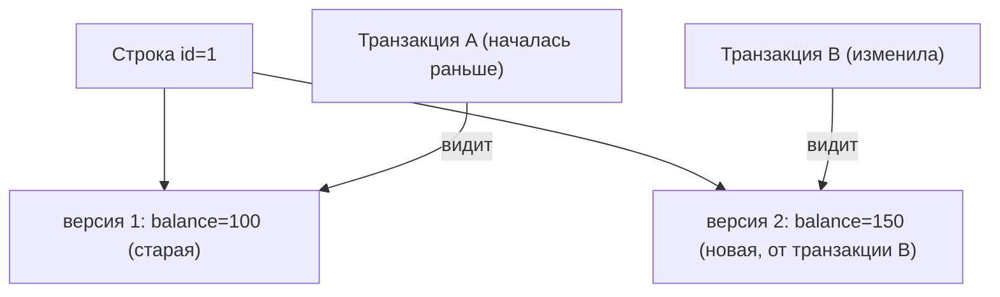

# MVCC в PostgreSQL

**MVCC** (Multi-Version Concurrency Control — управление конкуренцией через
многоверсионность) — это то, как PostgreSQL позволяет множеству транзакций читать и
писать одновременно, почти не блокируя друг друга. Главный эффект, ради которого о
нём спрашивают: **читатели не блокируют писателей, а писатели — читателей**.

## Идея: несколько версий одной строки

Обычная наивная схема: чтобы изменить строку, надо её заблокировать, и читатели ждут.
MVCC делает иначе: при изменении строки создаётся её **новая версия**, а старая
остаётся жить, пока её ещё кто-то читает.

То есть в таблице физически может лежать **несколько версий** одной логической
строки. Каждая транзакция видит ту версию, которая была актуальна на момент её
начала.

## Почему чтение не блокирует запись

Вот ключевой вывод. Пока транзакция B **изменяет** строку (создаёт новую версию),
транзакция A, которая просто **читает**, спокойно берёт **старую** версию — ей не
нужно ждать B. И наоборот: читатели не мешают писателю.

Сравни с блокировочным подходом, где `SELECT` мог бы ждать `UPDATE`. В MVCC обычный
`SELECT` **не ставит блокировок** вообще — отсюда высокая параллельность
PostgreSQL под нагрузкой на чтение.

## Как это связано с уровнями изоляции

MVCC — это механизм, на котором держатся [уровни изоляции](isolation-levels.md):

- на **READ COMMITTED** каждая команда видит снимок данных на момент **своего
  начала** — то есть последнюю закоммиченную версию;
- на **REPEATABLE READ** вся транзакция видит один снимок на момент **своего старта**
  — поэтому повторные чтения стабильны, и в PostgreSQL этот уровень заодно защищает
  от фантомов.

«Снимок» (snapshot) — это и есть «какие версии строк мне видны». MVCC решает, какую
версию показать каждой транзакции.

## Обратная сторона: «мусорные» версии и VACUUM

Раз старые версии строк не удаляются сразу, они **накапливаются** («мёртвые» кортежи
после UPDATE/DELETE). Их подчищает фоновый процесс **VACUUM** (и autovacuum). Если
не подчищать — таблица разбухает. Это чисто эксплуатационная деталь, но знать
полезно: цена MVCC — необходимость уборки мусора.

## Что запомнить

- MVCC хранит **несколько версий** строки; каждая транзакция видит свою по «снимку».
- Главное: **читатели не блокируют писателей и наоборот**; обычный `SELECT` не ставит
  блокировок → высокая параллельность.
- На MVCC построены уровни изоляции (снимок на начало команды или транзакции).
- Плата — старые версии строк, которые убирает **VACUUM**.
