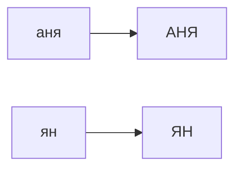
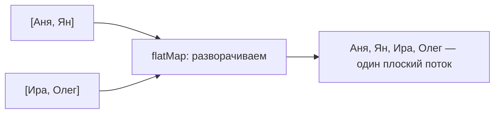

# `map` vs `flatMap`

Обе операции преобразуют элементы стрима. Разница в одном: `map` превращает
элемент в **один** новый элемент, а `flatMap` — в **несколько** (в целый стрим),
которые потом «расклеиваются» в один общий поток. Путаница здесь частая, поэтому
разберём на примерах.

## `map` — один в один

`map` берёт каждый элемент и заменяет его на **один** другой. Сколько элементов
было — столько и осталось.

```java
List<String> names = List.of("аня", "ян");
List<String> upper = names.stream()
        .map(String::toUpperCase)   // "аня" → "АНЯ", "ян" → "ЯН"
        .toList();                  // [АНЯ, ЯН] — снова 2 элемента
```



## `flatMap` — один во много, потом всё в кучу

`flatMap` нужен, когда из каждого элемента получается **не одно значение, а
коллекция** (или стрим). Если бы мы применили `map`, получили бы «стрим списков» —
вложенную структуру. `flatMap` дополнительно **разворачивает** эти списки в один
плоский поток.

Пример: есть список групп, в каждой — список людей. Нужен один список всех людей.

```java
List<List<String>> groups = List.of(
        List.of("Аня", "Ян"),
        List.of("Ира", "Олег")
);

List<String> all = groups.stream()
        .flatMap(List::stream)   // каждый список → его элементы, всё в один поток
        .toList();               // [Аня, Ян, Ира, Олег]
```



Если бы здесь стоял `map(List::stream)`, на выходе был бы `Stream<Stream<String>>`
— поток потоков, с которым неудобно работать. `flatMap` убирает эту вложенность.

## Как различать

- Из элемента получается **одно** значение → `map`.
- Из элемента получается **список/стрим значений**, и их надо слить в один поток →
  `flatMap`.

Простыми словами: `map` — «переделай каждый элемент», `flatMap` — «переделай каждый
элемент в несколько и собери всё вместе».
